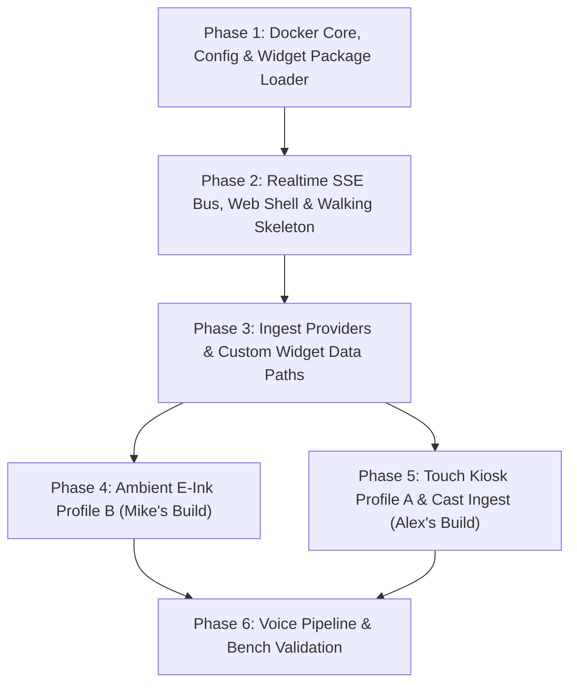

# Mirrormere Full Implementation Plan & Chunking Roadmap

> **For agentic workers:** REQUIRED SUB-SKILL: Use `superpowers:subagent-driven-development` or `superpowers:executing-plans` to implement this plan task-by-task. Steps use checkbox (`- [ ]`) syntax for tracking.

**Goal:** Build and deliver Mirrormere from ground up—a local-first, headless Go smart display daemon with real-time SSE bus, pluggable server-side rendered widget architecture, low-power Ambient E-Ink profile (Waveshare 7.5" + Pi 4B), and 60Hz Wayland Touch Kiosk profile (UPERFECT 15.6" + N100).

**Architecture:** Headless Go 1.24 daemon (`internal/`) exposing an OpenAPI 3.1 REST API and SSE event bus (`GET /api/events`), serving a lightweight vanilla ES6 PWA display shell (`web/`) with server-side rendered widget components (`widgets/`), backed by pluggable data providers with Stale-While-Revalidate caching, decoupled hardware sidecars (`sidecars/cast-watcher`, `sidecars/eink-renderer`), and edge hardware companions (`clients/eink-node`, `clients/mirrormere-voice`).

**Tech Stack:** Go 1.24 (standard library `net/http`, Slowloris hardening, `oapi-codegen`, zero-CGO SQLite via `modernc.org/sqlite`), Vanilla ES6 / CSS3 (Cyber HUD tokens, CSS Grid, WebRTC), Docker Compose multi-arch, Python 3.11 (CastV2, Waveshare SPI e-paper).

**Specs:** `specs/001-architecture-overview.md` through `specs/012-live-config-reload-and-lkgc.md`.

---

## Global Constraints & Quality Floor
- **Language & Runtime:** Go 1.24 static Linux binaries, standard library `net/http` with Slowloris mitigation (`ReadHeaderTimeout: 3s`, `ReadTimeout: 5s`, `WriteTimeout: 10s`, `IdleTimeout: 120s`). SSE streaming endpoints disable write deadlines via `http.ResponseController(w).SetWriteDeadline(time.Time{})`.
- **Test Coverage:** Strict `>= 95.0%` statement coverage floor across all Go packages, gated locally via `scripts/check-coverage.sh` and `./scripts/verify.sh`.
- **API First:** Single source of truth in `api/openapi.yaml` and `api/schemas/*.json`. Compile-time interface compliance via `oapi-codegen` into `internal/api/`. Zero contract drift.
- **Audio Ceiling:** Enforce master volume 80% ceiling strictly in client DOM software (`element.volume = (volume / 100) * 0.80 * (isDucked ? 0.20 : 1.0) * (isMuted ? 0.0 : 1.0)`), zero host-level OS settings or PipeWire manipulation.
- **Read-Only Ambient Tasks Contract:** Mirrormere operates strictly as a read-only ambient display surface for lists and tasks (SPEC-006 §7, SPEC-008). Zero write mutations, zero provisional IDs, and zero client-side optimistic UI reconciliation. Lists ingest via pluggable `ListSource` adapters (`local`, `gtasks`, `http`), inspected exclusively via `GET /api/lists/{list_id}/items`.
- **Deterministic 6×2 Grid Engine:** 6 columns × 2 rows = 12 discrete cells below a fixed header zone, solved via a 2D recursive backtracking bitmask solver (`0x000` to `0xFFF`) with pinned widget replication, auto-computed minimum screens, and deficit guidance (SPEC-005).
- **Zero `${VAR}` Env Interpolation:** Secrets are resolved exclusively via explicit `*_env` keys (`token_env`, `url_env`) per SPEC-012 §6. No arbitrary string interpolation.
- **Deployment-Time Configuration:** Zero runtime theme switching or multi-tenant display multiplexing. Independent container instances load their owner's specific config and mounted stylesheet.

---

## Phase Breakdown & Milestone Chunking

---

### Phase 1: Docker Core, Config & Widget Package Loader
**Objective:** Establish Day-1 Docker Compose, authoritative OpenAPI/SSE contracts, config parser with LKGC, full widget package loader, and 6×2 layout solver with 100% test coverage before implementing business logic.

- [ ] **Task 1.1: Docker Compose Foundation & Scaffolding**
  - Files:
    - Create: `deploy/compose.yml` (base multi-container Docker Compose with build targets)
    - Create: `Dockerfile` (multi-stage Go 1.24 static binary build, non-root user)
    - Create: `deploy/examples/config.yaml`
    - Create: `deploy/examples/custom.css`
  - Deliverable: Reproducible container build running a healthcheck endpoint from Day 1.

- [ ] **Task 1.2: OpenAPI 3.1 Specification & SSE JSON Schemas**
  - Files:
    - Create: `api/openapi.yaml` (full REST API specification per SPEC-003, SPEC-004, SPEC-006, SPEC-007, SPEC-008, SPEC-012)
    - Create: `api/schemas/widget.update.json`
    - Create: `api/schemas/header.update.json`
    - Create: `api/schemas/screen.rotate.json`
    - Create: `api/schemas/system.status.json`
    - Create: `api/schemas/video.state.json`
    - Create: `api/schemas/audio.state.json`
    - Create: `api/schemas/voice.state.json`
    - Create: `api/schemas/widget.reload.json`
    - Create: `api/schemas/style.reload.json`
  - Endpoints to Codify:
    - `GET /healthz`, `GET /health`
    - `GET /api/events` (SSE bus)
    - `POST /api/screen/select`, `POST /api/screen/advance`, `POST /api/screen/pause`
    - `GET /api/audio`, `POST /api/audio/volume`, `POST /api/audio/mute`
    - `POST /api/video/trigger`, `POST /api/video/dismiss`, `POST /api/video/state`, `POST /api/video/action`
    - `POST /api/voice/state`
    - `GET /api/lists/{list_id}/items`
    - `GET /api/widgets/{widget_id}/state`
    - `GET /api/widgets/{widget_id}/render` (SSR HTML fragment)
    - `GET /widget-types/{type}/assets/{path}` (Widget package static asset route)
    - `POST /api/widgets/{widget_id}/push` (Push webhook data path; rejected with 409 Conflict on task widgets)
  - Deliverable: Validated OpenAPI 3.1 contract and JSON Schemas with compile-time code generation via `oapi-codegen`.

- [ ] **Task 1.3: Configuration Engine with Explicit `*_env` Resolution & LKGC**
  - Files:
    - Create: `internal/config/config.go`
    - Create: `internal/config/config_test.go`
  - Requirements:
    - Parse `config.yaml` with schema validation (`screens`, `widgets`, `display`, `providers`).
    - Resolve secrets strictly through explicit `*_env` keys (`token_env`, `url_env`) reading from the host environment. Zero `${VAR}` string interpolation (SPEC-012 §6).
    - Last Known Good Configuration (LKGC) in-memory fallback on parse failure.
  - Deliverable: Hermetic unit tests achieving `>= 95%` coverage validating valid, invalid, and edge configuration structures.

- [ ] **Task 1.4: Widget Package Loader & 6×2 Layout Bitmask Solver**
  - Files:
    - Create: `internal/domain/widget.go`
    - Create: `internal/domain/manifest.go`
    - Create: `internal/widget/loader.go`
    - Create: `internal/widget/loader_test.go`
    - Create: `internal/layout/solver.go`
    - Create: `internal/layout/solver_test.go`
  - Requirements:
    - Widget package discovery across built-ins (`/app/widgets`) and overrides/custom (`/config/widgets`). Whole-package overriding invariant: any custom widget must supply complete package (`manifest.yaml`, `views/widget.html`, assets).
    - Parse and validate `manifest.yaml` (schema validation: forbid `default` keyword in config schema, validate supported dimensions).
    - Apply `default_dimensions` when instance config omits `width`/`height`.
    - Implement exact 2D recursive backtracking bitmask solver for 6×2 grid (`cols ∈ [0, 5]`, `rows ∈ [0, 1]`, 12 discrete cells):
      - Compute minimal rotation screens: $K = \lceil A_{\text{unpinned}} / (12 - A_{\text{pinned}}) \rceil$.
      - Pinned widget replication across all screens.
      - Bitmask placement verification (`screen_bitmask == 0xFFF`).
      - Helpful layout deficit and spacer tile (`type: spacer`) guidance on tiling errors per SPEC-005.

---

### Phase 2: Realtime SSE Bus, Web Shell & Walking Skeleton
**Objective:** Deliver the centralized SSE bus, rotation engine, `html/template` SSR engine, `fsnotify` live reload, and vanilla ES6 display HUD—achieving an end-to-end "walking skeleton" displaying live grid cells in the browser.

- [ ] **Task 2.1: High-Performance SSE Bus & Initial Hydration**
  - Files:
    - Create: `internal/events/bus.go`
    - Create: `internal/events/bus_test.go`
    - Create: `internal/events/handler.go`
    - Create: `internal/events/handler_test.go`
  - Requirements:
    - `GET /api/events` handler supporting concurrent display clients.
    - Zero write deadlines on SSE connections via `http.ResponseController(w).SetWriteDeadline(time.Time{})`.
    - 1,000 events / 5-minute ring buffer for `Last-Event-ID` reconnection replay.
    - Periodic heartbeat ping (`: ping\n\n`) every 15s.
    - **Initial State Hydration Invariant (SPEC-006 §3)**: Flushes full snapshot across all configured widgets and screens on initial connection (`screen.rotate`, all `widget.update`s, `header.update`, `video.state`, `audio.state`, `voice.state`, `system.status`).

- [ ] **Task 2.2: Screen Rotation Coordinator & Navigation Endpoints**
  - Files:
    - Create: `internal/rotation/coordinator.go`
    - Create: `internal/rotation/coordinator_test.go`
    - Create: `internal/api/handlers_screen.go`
    - Create: `internal/api/handlers_screen_test.go`
  - Requirements:
    - Timer-driven screen rotation (`display.rotation.interval_seconds`).
    - Emit `screen.rotate` carrying active screen index and SSR HTML fragments for current widgets.
    - Implement navigation endpoints: `POST /api/screen/select`, `POST /api/screen/advance`, and `POST /api/screen/pause` (with optional `duration_seconds: 120` auto-resume timer).

- [ ] **Task 2.3: Server-Side Rendering (SSR) Engine & Static Asset Pipeline**
  - Files:
    - Create: `internal/render/engine.go`
    - Create: `internal/render/engine_test.go`
    - Create: `internal/api/handlers_render.go`
    - Create: `internal/api/handlers_render_test.go`
  - Requirements:
    - In-process `html/template` renderer executing widget `views/widget.html`.
    - Route `GET /api/widgets/{widget_id}/render`: renders HTML fragment using active widget state.
    - Route `GET /widget-types/{type}/assets/{path}`: serves static assets from widget package directory.
    - Route `GET /config/custom.css`: serves user custom stylesheet.

- [ ] **Task 2.4: `fsnotify` File Watcher & Dynamic Hot Reloading (SPEC-012)**
  - Files:
    - Create: `internal/watcher/watcher.go`
    - Create: `internal/watcher/watcher_test.go`
  - Requirements:
    - Monitor `/config/` directory with 100ms debouncing.
    - On `config.yaml` modification: trigger atomic reload and state reconcile or LKGC fallback.
    - On `/config/custom.css` change: emit `style.reload` SSE event.
    - On `/config/widgets/` modification: reload template and emit `widget.reload` SSE event.

- [ ] **Task 2.5: Web Display HUD & Walking Skeleton**
  - Files:
    - Create: `web/templates/display.html`
    - Create: `web/static/css/hud.css` (Cyber HUD variables, CSS Grid tokens, high-contrast dark theme)
    - Create: `web/static/js/sse.js` (EventSource wrapper with exponential backoff & hydration listener)
    - Create: `web/static/js/carousel.js` (Screen rotation, DOM pre-warming, touch swipe controller)
    - Create: `widgets/spacer/manifest.yaml` & `widgets/spacer/views/widget.html`
  - Requirements:
    - Render 6×2 CSS grid canvas below fixed header.
    - Listen for `screen.rotate`, hot-swap DOM fragments, and handle `widget.reload` and `style.reload`.
    - Pre-warm rotation screens in background DOM to eliminate blank frame artifacts.
    - Deliverable: End-to-end working container where `/display` renders a live, rotating grid with header clock and spacer widgets!

---

### Phase 3: Ingest Providers & Custom Widget Data Paths
**Objective:** Implement decoupled data ingestion workers with Stale-While-Revalidate caching, rate limiting, custom HTTP polling/push paths, and zero-CGO SQLite storage.

- [ ] **Task 3.1: Provider Polling Coordinator & SWR Cache**
  - Files:
    - Create: `internal/provider/provider.go`
    - Create: `internal/provider/cache.go`
    - Create: `internal/provider/coordinator.go`
  - Requirements:
    - Pluggable `Provider` interface: `ID() string`, `Fetch(ctx context.Context) (any, error)`, `Interval() time.Duration`.
    - In-memory Stale-While-Revalidate cache: return stale data immediately on transient errors while logging background fetch failures.
    - Exponential backoff with jitter on network refusal or upstream 5xx.
    - Degraded state tracking: `healthy`, `degraded` (LKG preserved, opacity 0.8), `error` (cold-boot empty state).

- [ ] **Task 3.2: Custom Widget Data Paths (HTTP Polling & Webhook Push)**
  - Files:
    - Create: `internal/provider/http/http.go`
    - Create: `internal/provider/http/http_test.go`
    - Create: `internal/api/handlers_push.go`
    - Create: `internal/api/handlers_push_test.go`
  - Requirements:
    - Generic `provider: http` poller: query arbitrary JSON endpoints (`POST {endpoint}` carrying instance config, or `GET`), validate response against manifest schema, update widget state.
    - Webhook data path: `POST /api/widgets/{widget_id}/push` validates payload against schema and updates state.
    - Reject push webhooks targeting task widgets with `409 Conflict`.

- [ ] **Task 3.3: Core Ingest Providers (Calendar, Weather & Photos)**
  - Files:
    - Create: `internal/provider/calendar/calendar.go`
    - Create: `internal/provider/weather/weather.go`
    - Create: `internal/provider/photos/photos.go`
    - Create: `widgets/calendar/manifest.yaml` & `views/widget.html`
    - Create: `widgets/weather/manifest.yaml` & `views/widget.html`
    - Create: `widgets/photos/manifest.yaml` & `views/widget.html`
  - Requirements:
    - Calendar: fetch and parse remote iCal (.ics) and CalDAV URLs (Google Calendar, iCloud, Fastmail/Nextcloud).
    - Weather: query Open-Meteo keyless API; autonomous poller emitting dedicated `header.update` SSE events (SPEC-007 §4).
    - Photos: zero-credential Google Photos shared album scraper extracting `AF_initDataCallback` image URLs with dynamic `=w{w}-h{h}-c` sizing parameters.

- [ ] **Task 3.4: Read-Only Tasks & Lists Service (SPEC-008)**
  - Files:
    - Create: `internal/storage/sqlite/db.go`
    - Create: `internal/provider/lists/lists.go`
    - Create: `internal/api/handlers_lists.go`
    - Create: `widgets/tasks/manifest.yaml` & `views/widget.html`
  - Requirements:
    - Pure-Go zero-CGO SQLite storage using `modernc.org/sqlite` in `/data/lists.db` (WAL mode, busy timeout 5000ms).
    - Read-only inspection endpoint: `GET /api/lists/{list_id}/items` (optional `include_done`).
    - Strike-through completed items, "+N more" overflow, zero client mutation controls.

---

### Phase 4: Ambient E-Ink Profile B (Mike's Build)
**Objective:** Deliver the low-power e-paper rendering companion and standalone SPI daemon for the Raspberry Pi 4B so Mike's hardware can be stood up first.

- [ ] **Task 4.1: Headless Snapshot Sidecar (`sidecars/eink-renderer`)**
  - Files:
    - Create: `sidecars/eink-renderer/Dockerfile`
    - Create: `sidecars/eink-renderer/renderer.go` (or Puppeteer script)
  - Requirements:
    - Capture 800×480 1-bit monochrome snapshot of `/display` on dirty trigger or rotation.
    - Floyd-Steinberg dithering for photos and grayscale images.
    - Expose 1-bit packed byte array or PNG at `GET /eink.png` with ETag caching.

- [ ] **Task 4.2: E-Ink Node Client (`clients/eink-node`)**
  - Files:
    - Create: `clients/eink-node/main.py`
    - Create: `clients/eink-node/driver/waveshare_7in5_v2.py`
    - Create: `clients/eink-node/requirements.txt`
    - Create: `clients/eink-node/config.yaml`
  - Requirements:
    - Adafruit Bonnet GPIO pin mapping: RST=27, DC=22, BUSY=17, CS=CE0 (GPIO 8), Buttons=GPIO 5 & 6 (SPEC-009).
    - Wire button tap on GPIO 5/6 to trigger `POST /api/screen/advance` on Core daemon.
    - Refresh lifecycle: 5s debounce, 60s minimum panel write floor, 60m full refresh cycle, deep sleep after every write.
    - Offline guard: 8×8 black dot in top-right corner if offline > 120s; persist last good frame to `/var/lib/mirrormere-eink/last.png`.
    - Standardized healthcheck endpoint on port 8099 (`GET :8099/healthz`).

---

### Phase 5: Touch Kiosk Profile A & Cast Ingest (Alex's Build)
**Objective:** Assemble the interactive 60Hz Touch Kiosk stack, hardware video capture pipeline, and Linux host provisioning.

- [ ] **Task 5.1: Audio Coordinator & DOM Ceiling**
  - Files:
    - Create: `internal/audio/coordinator.go`
    - Create: `internal/api/handlers_audio.go`
    - Create: `web/static/js/audio.js`
  - Requirements:
    - `GET /api/audio`, `POST /api/audio/volume`, `POST /api/audio/mute`.
    - Strict 80% DOM volume ceiling: `(vol/100)*0.80*(isDucked?0.2:1)*(isMuted?0:1)`. Zero host OS PipeWire manipulation.
    - Touch volume slider 200ms debounce during continuous drag; commit on `pointerup`.

- [ ] **Task 5.2: Video State Relay & Priority Stack**
  - Files:
    - Create: `internal/video/coordinator.go`
    - Create: `internal/api/handlers_video.go`
    - Create: `web/static/js/webrtc.js`
  - Requirements:
    - Priority stack: `doorbell` PiP > `chromecast` fullscreen.
    - Endpoints: `POST /api/video/trigger`, `dismiss`, `state`, `action`.
    - Embed go2rtc WebRTC stream playback with touch HUD overlay.

- [ ] **Task 5.3: CastV2 Socket Monitor (`sidecars/cast-watcher`) & `go2rtc` Ingest**
  - Files:
    - Create: `sidecars/cast-watcher/Dockerfile`
    - Create: `sidecars/cast-watcher/main.py`
    - Create: `deploy/go2rtc.yaml`
  - Requirements:
    - Connect to Chromecast TCP port 8009 over LAN.
    - Detect active casting (`appId != "E8C28D3C"`), trigger video overlay (`POST /api/video/trigger`), and dismiss on return to backdrop.
    - Hardware transcoding (`#video=h264#hardware` via Intel VAAPI/QSV on the N100) capturing UVC MS2130 and ALSA audio.

- [ ] **Task 5.4: Kiosk Host Provisioning & Wayland Confinement**
  - Files:
    - Create: `deploy/kiosk/install.sh`
    - Create: `deploy/kiosk/mirrormere-kiosk.service`
    - Create: `deploy/kiosk/launch.sh`
  - Requirements:
    - Minimal Wayland `cage` compositor launching Chromium with flags: `--kiosk --ozone-platform=wayland --use-gl=egl --autoplay-policy=no-user-gesture-required`.
    - Power management: `swayidle` 10m idle blanking (`wlr-randr --output HDMI-A-1 --off`) with capacitive touch wake (`evdev`), and systemd night schedule timers (23:00 sleep / 06:00 wake).
    - Nightly automated browser process restart during the sleep window to prevent 24/7 memory drift.

---

### Phase 6: Voice Pipeline, Integration & Bench Validation
**Objective:** Connect the voice state relay, verify multi-container profiles, and validate bench hardware.

- [ ] **Task 6.1: Voice State Relay & Caption Toasts**
  - Files:
    - Create: `internal/api/handlers_voice.go`
    - Create: `web/static/js/toasts.js`
  - Requirements:
    - `POST /api/voice/state` rebroadcasting `voice.state` SSE events to all connected clients.
    - Transient caption toasts for wake word / STT / TTS states.

- [ ] **Task 6.2: Multi-Arch Compose & Bench Bringup**
  - Files:
    - Update: `deploy/compose.yml` (`profiles: [video, eink]`)
  - Requirements:
    - Bench bringup on Alex's N100 touch sandwich and Mike's Pi 4B e-paper.
    - End-to-end integration tests and healthcheck verification.

---

## Execution Strategy & Review Checkpoints

1. **Test-Driven Development (TDD):** Every Go package must maintain a companion `_test.go` suite achieving `>= 95.0%` statement coverage before moving to subsequent tasks.
2. **Autonomous Scratch PRs:** All development is carried out in isolated scratch workspaces submitted via GitOps PR workflows, validated via `./scripts/verify.sh --staged` and GitHub Actions CI.
3. **The Girl Gang Review Gates:** Plan and architecture audited by the 4-member Girl Gang review panel prior to executing major chunks.
