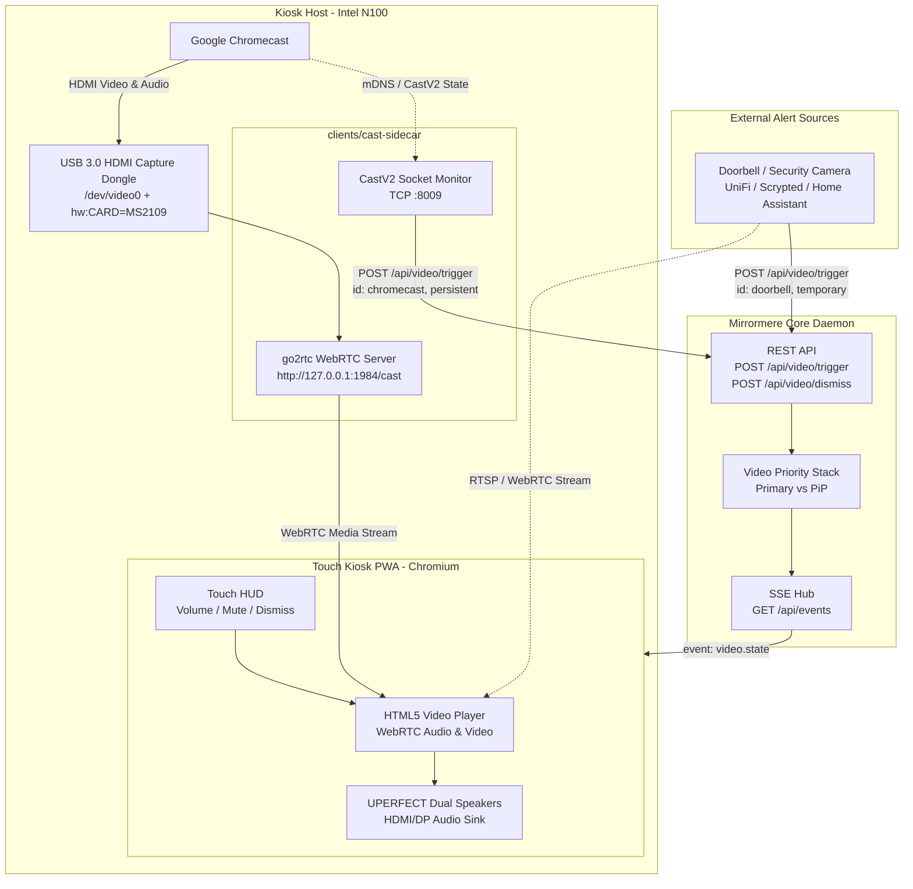

# SPEC-004: Unified Video Stream API, Picture-in-Picture Priority Stack, and Cast Sidecar

## Status
Approved / Day 1 Architecture (Profile A)

## Context & Motivation
Smart wall displays frequently handle multiple video feeds:
1. **Persistent Media Streaming**: Google Cast (YouTube, Spotify, Netflix, Plex) via a physical Chromecast.
2. **High-Priority Temporary Alerts**: Front door camera streams triggered by doorbell ring events.

Traditional approaches either hardcode browser-level webcam APIs (`getUserMedia`) to capture local USB dongles or create bespoke modal popups for security cameras. Both create severe architectural issues:
- `getUserMedia` couples the browser frontend to specific host hardware, requires intrusive browser permission prompts, and breaks when testing remotely or across different devices.
- Ambient backdrop trap: A physical Chromecast continuously outputs an active 1080p60 HDMI signal even when idle (displaying landscape photos). Hardware-level signal detection cannot distinguish between active media and the idle screensaver.
- Multi-feed collisions: When a doorbell rings while a cast is playing, audio and video must not clobber each other.

Mirrormere solves this cleanly by adopting a **Hardware-Agnostic Unified Video Stream Architecture**:
- All video sources feed into a single, consistent REST API (`POST /api/video/trigger`).
- Mirrormere Core manages a first-class **Video Priority Stack** with automatic Picture-in-Picture (PiP) handoff.
- Local hardware conversion and Cast protocol monitoring are isolated in an edge **Kiosk Cast Sidecar** (`clients/cast-sidecar`).

---

## System Architecture



---

## The Unified Video Stream API

Mirrormere Core exposes two generic endpoints for video lifecycle management:

### 1. Trigger Video Stream (`POST /api/video/trigger`)
Dispatched when any video source becomes active.

**Headers**:
```http
Content-Type: application/json
Accept: application/json
```

**Payload Schema**:
```json
{
  "id": "chromecast",
  "stream_url": "http://127.0.0.1:1984/cast",
  "type": "webrtc",
  "priority": "persistent",
  "timeout_seconds": 0
}
```

- `id` (string, required): Unique identifier for the stream source (e.g. `"chromecast"`, `"doorbell_front"`).
- `stream_url` (string, required): Playable stream URL accessible to the display client (WebRTC, HLS, or MJPEG).
- `type` (string, default `"webrtc"`): Stream format (`"webrtc"`, `"hls"`, `"mjpeg"`).
- `priority` (string, default `"persistent"`):
  - `"persistent"`: Remains active until explicitly dismissed (e.g. casting).
  - `"temporary"`: Automatically dismisses after `timeout_seconds` (e.g. doorbell ring).
- `timeout_seconds` (integer, optional): Auto-dismiss timeout for temporary streams (default 45s). Ignored for persistent streams.

### 2. Dismiss Video Stream (`POST /api/video/dismiss`)
Dispatched when media stops or when manually dismissed by a client.

**Payload Schema**:
```json
{
  "id": "chromecast"
}
```

---

## The Video Priority Stack & Display Modes

The Touch Kiosk UI supports two primary display modes:
1. **`widgets` Mode**: The standard 6×2 grid canvas with fixed header (SPEC-005).
2. **`video` Mode**: Dedicated fullscreen video presentation.

Mirrormere Core manages active video streams in a **Last-In, Highest-Priority Stack**:

```
[ Top / Primary (Fullscreen) ] -> Latest triggered video
[ Bottom / PiP (Corner Dock) ]  -> Older active video (if any)
```

### Transition State Machine

1. **Idle (`widgets` mode)**:
   - When a video triggers (`POST /api/video/trigger`), the UI immediately transitions to `video` mode, mounting the stream full-screen.
2. **Video-Over-Video Collision (PiP Handoff)**:
   - When a new video triggers while already in `video` mode (e.g. a doorbell rings while casting YouTube):
     - The **newest video (Doorbell)** immediately takes **full-screen**.
     - The **older video (Chromecast)** smoothly transitions into a floating **Picture-in-Picture (PiP)** window in the lower-right corner.
3. **Stream Dismissal**:
   - When the top video dismisses (doorbell timer expires or user taps dismiss 'X'):
     - The top video unmounts.
     - The PiP stream (Chromecast) smoothly expands back to full-screen.
4. **Empty Stack Return**:
   - When all video streams are dismissed (or casting disconnects), the display transitions back to `widgets` mode.

### SSE Wire Schema (`video.state`)

Whenever the priority stack mutates, Mirrormere broadcasts a `video.state` event across `GET /api/events` (SPEC-006):

```http
event: video.state
id: evt_1727221200_01
data: {"mode":"video","primary":{"id":"doorbell","stream_url":"http://homeassistant:1984/doorbell","type":"webrtc","timeout_seconds":45},"pip":{"id":"chromecast","stream_url":"http://127.0.0.1:1984/cast","type":"webrtc"}}
```

When no videos remain active:
```http
event: video.state
id: evt_1727221245_02
data: {"mode":"widgets","primary":null,"pip":null}
```

---

## Kiosk Cast Sidecar (`clients/cast-sidecar`)

To keep Mirrormere Core and the Touch PWA completely hardware-agnostic, all physical USB capture and Cast protocol tracking are handled by an edge sidecar running directly on the kiosk Mini PC.

### 1. Hardware Stream Producer (`go2rtc`)
The physical Chromecast plugs into a USB 3.0 HDMI capture card (MacroSilicon MS2109 or similar).
The sidecar runs `go2rtc` as a lightweight media bridge:
```yaml
# go2rtc.yaml
streams:
  cast:
    - ffmpeg:device?video=/dev/video0&audio=hw:CARD=MS2109#video=copy#audio=opus
```
- Ingests 1080p60 HDMI video directly over `/dev/video0` (UVC) and digital audio over ALSA (UAC).
- Serves sub-10ms, hardware-accelerated WebRTC locally at `http://127.0.0.1:1984/cast`.

### 2. CastV2 Socket Monitor (Avoiding the Backdrop Trap)
Chromecast continuously outputs 1080p HDMI video even when idle, rendering the Google Ambient Backdrop slideshow.
The sidecar connects directly to the Chromecast's LAN IP over TCP port 8009 (**Google Cast v2 protocol**):
- Subscribes to the receiver status channel (`urn:x-cast:com.google.cast.receiver`).
- **Active Casting Detected**: When `applications[0].appId != "E8C28D3C"` (not the Backdrop app), casting is active. The sidecar immediately dispatches `POST /api/video/trigger`.
- **Casting Disconnected**: When the status returns to Backdrop or empty, the sidecar dispatches `POST /api/video/dismiss`.

---

## Unified WebRTC Audio Pipeline & Controls

Because audio is packaged directly into the WebRTC stream alongside video, Chromium's standard HTML5 `<video>` element acts as the single source of truth for audio output.

### 1. Audio Routing & Ducking
- **Audio Output**: Chromium plays audio through the default ALSA/PipeWire sink, driving the UPERFECT monitor's integrated dual stereo speakers over HDMI/USB-C.
- **PiP Audio Focus**: The primary full-screen video holds audio focus (`primaryVideo.muted = false`). Any secondary video docked into PiP is **automatically muted** (`pipVideo.muted = true`).
- **Audio Ducking**: When a doorbell rings during a cast, the Chromecast audio is muted instantly upon moving to PiP. When the doorbell finishes, Chromecast audio resumes without user intervention.

### 2. Volume Controls
- **Remote / Phone Volume**: When casting from a phone, the user's phone volume rocker attenuates audio digitally at the Chromecast hardware source via CastV2.
- **On-Screen Touch HUD**: Tapping the video screen displays a touch HUD overlay (auto-fading after 3s) containing:
  - Mute / unmute toggle button.
  - Linear volume slider (0–100%) controlling `video.volume`.
  - Manual dismiss ('X') button.
  - Volume preference is stored in `localStorage` across video sessions.
- **Host Hardware Ceiling**: WirePlumber configures an 80% maximum volume ceiling on boot to prevent chassis speaker distortion or clipping.
