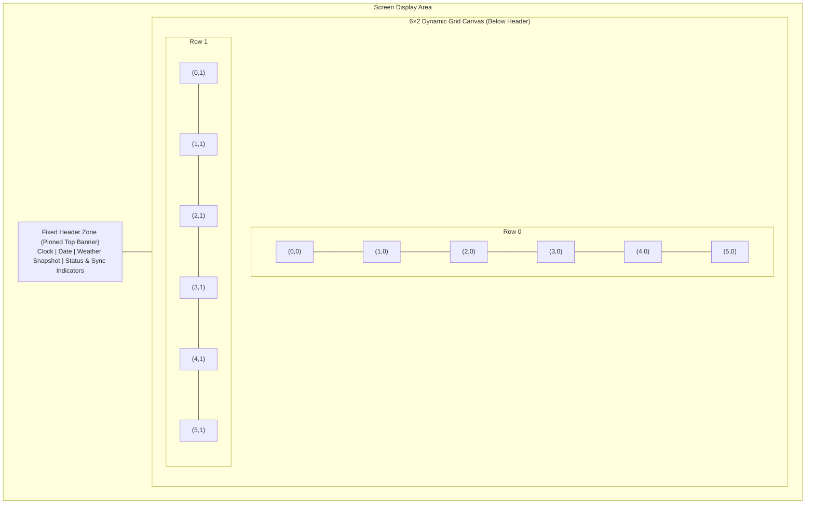

# SPEC-005: Screen Layout, 6×2 Grid Tiling, and Rotation Engine

## Status
Approved / Core Layout Specification

## Context & Motivation
Ambient displays and smart wall dashboards (such as the 15.6" 1080p Touch Kiosk and 7.5" 800×480 E-Paper panel) have strictly constrained physical display areas. Real-world households consistently demand more widgets (family calendar, weather forecast, chore checklist, home automation switches, photo carousel, transit times) than can comfortably fit simultaneously on a single static screen.

Rather than relying on unconstrained free-floating dashboards or dynamic query-param multi-tenancy, Mirrormere standardizes on a **deterministic 6×2 grid canvas with an exact bin-packing rotation engine**.

---

## Screen Anatomy

Every Mirrormere display surface is partitioned into two distinct vertical zones:



### 1. Fixed Header Zone (Pinned Top Banner)
- Pinned at the top of the display surface across all rotation cycles.
- Never flips, rotates, or unmounts during screen transitions.
- Displays high-priority ambient glance data:
  - Digital / analog clock and full formatted calendar date.
  - Quick-look weather summary badge (current temp and condition icon).
  - Ambient status indicators (`.pill-badge` capsules for Wi-Fi/network connectivity, backend sync health, and active alerts).
- Allocated a fixed vertical height (~10–12% of total display height; e.g. 100–120px on 1080p, 60px on 800×480 e-paper).
- **Glance-First Information Partitioning**: The fixed header zone is the sole authoritative host for ambient glance metrics (clock, calendar date, weather temperature/condition, and sensor badges). This guarantees that lower-body widgets—especially the family photo carousel—remain 100% clean, edge-to-edge, and unobstructed by redundant overlaid clocks or sensor widgets.

### 2. Dynamic 6×2 Grid Canvas (Lower Body)
- Occupies the remaining screen height below the fixed header.
- Structured strictly as **6 columns × 2 rows** (total 12 discrete grid cells).
- Discrete integer coordinate system: `(col, row)` where `col ∈ [0, 5]` and `row ∈ [0, 1]`.

---

## Why the 6×2 Grid Wins

Because 6 is composite with factors 1, 2, 3, and 6, the 6×2 grid natively satisfies all dashboard layout archetypes with zero structural complexity:

| Layout Archetype | Column Split | Widget Grid Dimensions | Best Suited For |
| :--- | :--- | :--- | :--- |
| **2/3 + 1/3 Golden Ratio** | 4 cols + 2 cols | `[4, 2]` + stacked `[2, 1]` | Hero Calendar + side-stacked Chores & Weather |
| **50 / 50 Symmetrical Split** | 3 cols + 3 cols | `[3, 2]` + `[3, 2]` | Dual Hero: Photo Carousel + Home Assistant Control |
| **Tri-Column Division** | 2 cols × 3 | `[2, 2]` × 3 | 3 equal-width columns (Chores, Weather, Transit) |
| **Full-Width Hero Canvas** | 6 cols | `[6, 2]` | Month View Calendar or Full-Screen Family Photo |
| **Horizontal Banners** | 6 cols × 1 row | `[6, 1]` + `[6, 1]` | Dual stacked full-width timelines or radar feeds |

---

## Declarative Widget Configuration Schema

Displays declare their active widgets, rotation behavior, and target dimensions in `config.yaml`:

```yaml
display:
  rotation:
    interval_seconds: 30 # Seconds between automatic screen advance; 0 disables rotation (manual only)
    transition: "slide" # Visual transition hint sent via SSE: "slide", "fade", "instant", "none"
    pause_on_touch: true # Pause rotation timer on user touch/pointer interaction (if supported by client)
    pause_duration_seconds: 120 # Seconds to pause automated rotation after interaction before resuming

  header:
    enabled: true
    elements:
      - clock
      - date
      - weather_badge
      - sync_status
    weather:                        # Fully autonomous header weather configuration (independent of widgets)
      refresh_interval_seconds: 900 # 15 minutes
      latitude: 37.8044
      longitude: -122.2712
      timezone: "America/Los_Angeles"
      units: imperial

  grid:
    columns: 6
    rows: 2

  # Array of widgets, target dimensions [cols, rows], and generic per-widget configuration
  widgets:
    - id: family-calendar
      type: calendar-agenda
      dimensions: [4, 2] # 2/3 width, full height (8 cells)
      pinned: false
      config:
        refresh_interval_seconds: 300
        view: week
        days_ahead: 7
    - id: daily-chores
      type: tasks
      dimensions: [2, 1] # 1/3 width, top half (2 cells)
      config:
        list_id: "chores"
        list_name: "Chores"
        source: gtasks
        refresh_interval_seconds: 120
        gtasks:
          tasklist_id: "MDk3..."
    - id: local-weather
      type: weather-forecast
      dimensions: [2, 1] # 1/3 width, bottom half (2 cells)
      config:
        refresh_interval_seconds: 900
        latitude: 37.8044
        longitude: -122.2712
        units: imperial
    - id: family-photos
      type: photo-carousel
      dimensions: [3, 2] # 1/2 width, full height (6 cells)
      config:
        share_url: "https://photos.app.goo.gl/AbCdEf123456789"
        refresh_interval_seconds: 3600
        cycle_interval_seconds: 60
    - id: home-assistant
      type: home-assistant
      dimensions: [3, 2] # 1/2 width, full height (6 cells)
```

### Supported Widget Dimensions
A widget's dimensions are specified as `[cols, rows]` where $1 \le cols \le 6$ and $1 \le rows \le 2$:
- `[6, 2]`: Full canvas hero (Area: 12)
- `[4, 2]`: 2/3 width, full height (Area: 8)
- `[3, 2]`: 1/2 width, full height (Area: 6)
- `[2, 2]`: 1/3 width, full height (Area: 4)
- `[1, 2]`: 1/6 width, full height column (Area: 2)
- `[6, 1]`: Full width, half height banner (Area: 6)
- `[4, 1]`: 2/3 width, half height (Area: 4)
- `[3, 1]`: 1/2 width, half height (Area: 3)
- `[2, 1]`: 1/3 width, half height card (Area: 2)
- `[1, 1]`: 1/6 width, half height chip (Area: 1)

---

## The Bin-Packing & Rotation Algorithm

On daemon startup or configuration reload, Mirrormere executes an exact 2D bin-packing solver to compute the minimum number of screens required to rotate through all configured widgets.

### Mathematical Invariants & Constraints

1. **Fewest Number of Screens ($K$)**:
   The engine computes the minimal screen count $K = \lceil \sum \text{Area}(w_i) / 12 \rceil$ needed to present all declared widgets.

2. **Strict Fully-Filled Screen Invariant**:
   Every screen must be 100% tiled with zero empty or dead grid cells.
   $$\sum_{w \in \text{Screen}_k} (w.\text{cols} \times w.\text{rows}) = 12 \quad \forall k \in [1..K]$$
   Configurations where the total widget area does not sum to a multiple of 12 ($12K$), or where widget geometries cannot tile a $6 \times 2$ rectangle without gaps, are rejected fast on config validation with explicit remediation diagnostics.

3. **Non-Overlapping Rectangular Tiling**:
   For every screen $k$, each placed widget occupies a bounding rectangle $[x, x + cols - 1] \times [y, y + rows - 1]$ such that no two widgets share any grid cell:
   $$\text{Cell}(x, y) \text{ is covered by exactly one widget } \forall x \in [0..5], y \in [0..1]$$

### Algorithmic Implementation (Exact Backtracking)

Because the grid is compact (only 12 discrete cells) and typical configurations contain 3 to 12 widgets, the search space is small ($< 10^4$ states). The packing engine solves the exact cover problem using recursive backtracking with bitmasks on config load in $< 1$ millisecond:

```
Function SolvePacking(widgets, target_screens):
    Sort widgets by area descending (heuristic optimization)
    Initialize screen bitmasks [0..K-1] to 0x000 (all 12 bits empty)

    Function Backtrack(widget_index):
        If widget_index == len(widgets):
            Return CheckAllScreensFullyFilled(screen_bitmasks)
        
        widget = widgets[widget_index]
        For each screen s in [0..K-1]:
            For each valid origin (col, row) on screen s:
                If widget fits at (col, row) without overlap:
                    Place widget (set bits on screen s)
                    If Backtrack(widget_index + 1):
                        Return True
                    Remove widget (clear bits on screen s)
        Return False
```

### Config Load Diagnostics & Deficit Guidance

If the user's configured widgets cannot cleanly partition into fully filled screens, the configuration loader fails fast with actionable suggestions:

```
[Mirrormere Config Error] Invalid widget layout configuration:
  Total widget area is 14 cells. 
  A 6x2 grid requires screen areas in multiples of 12 (Target: 2 screens = 24 cells).
  Deficit: 10 cells needed to achieve 100% fully-filled screens.
  Suggestions:
    - Add a [4, 2] widget (8 cells) and a [2, 1] widget (2 cells).
    - Or expand existing [2, 1] widgets to [3, 2] / [4, 2].
```

---

## Pinned Widgets & Screen Replication

To accommodate primary household hero widgets (such as a 4×2 Family Calendar) that users want visible at all times, widgets can optionally declare `pinned: true` or specify explicit target screens:

```yaml
display:
  widgets:
    - id: family-calendar
      type: calendar-agenda
      dimensions: [4, 2]
      pinned: true # Automatically replicated onto all rotation screens

    # Remaining widgets rotate through the 2x2 side panel (4 cells per screen):
    - id: daily-chores
      type: tasks
      dimensions: [2, 1]
    - id: local-weather
      type: weather-forecast
      dimensions: [2, 1]
    - id: transit-commute
      type: transit-commute
      dimensions: [2, 1]
    - id: trash-schedule
      type: trash-schedule
      dimensions: [2, 1]
```

- When `pinned: true` is set, the solver accounts for the pinned widget's area across each screen, ensuring the remaining rotating widgets perfectly tile the remaining grid cells.

---

## Display Adaptation & Tuning Knobs

Mirrormere's Go daemon is strictly hardware-agnostic and maintains no concept of hardware profiles or device classes. Instead, deployments tune generic configuration knobs in `config.yaml` to match their hardware capabilities and physical refresh constraints:

| Feature / Goal | Interactive Touch Kiosks (60Hz) | Ambient E-Paper / Low-Refresh (0.01Hz) |
| :--- | :--- | :--- |
| **Rotation Cadence** | `interval_seconds: 30` (fast carousel) | `interval_seconds: 600` (10 min) or `0` (manual only) |
| **Transition Animation** | `transition: "slide"` (CSS animated) | `transition: "instant"` (zero CSS animation overhead) |
| **Touch Interaction** | `pause_on_touch: true` | `pause_on_touch: false` |
| **Screen Advancing** | Automatic timer + touch swipe gestures | Timer, physical GPIO button, or REST API |
| **Header Persistence** | Continuous live DOM header | Statically redrawn on coalesced buffer captures |

### Rotation Modes & Invariants
1. **Periodic Timed Rotation (`interval_seconds > 0`)**:
   - The Go daemon automatically emits `screen.rotate` events every $N$ seconds.
   - Deployments can set this to fast intervals (e.g. 15–60s) for active touchscreen kiosks, or slow intervals (e.g. 300–900s) for low-refresh ambient displays.
2. **Manual / Event-Driven Rotation (`interval_seconds: 0`)**:
   - The automated rotation timer loop is disabled entirely.
   - The display remains on the active screen until explicitly advanced via:
     - REST API call (`POST /api/screen/select` or `POST /api/screen/advance` per SPEC-006).
     - Physical hardware button (e.g. Adafruit Bonnet Button 2 on GPIO 6 via client webhook per SPEC-009).
     - Touch swipe gestures on interactive clients.
     - Webhook or high-priority automation alert.

### Hardware Protection Decoupling
The Mirrormere daemon enforces zero hardware-specific validation rules or artificial interval minimums. Panel protection constraints (such as enforcing minimum refresh intervals to avoid e-paper ghosting or hardware degradation) belong strictly at the physical client node level (e.g. `clients/eink-node` per SPEC-009) or are set by the operator in `config.yaml`.
