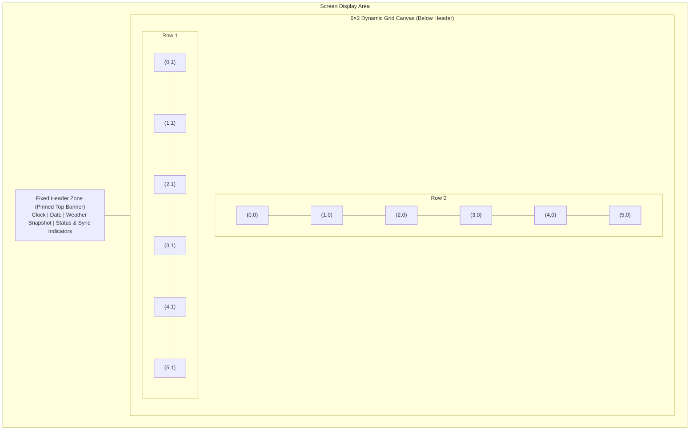

# SPEC-005: Screen Layout, 6×2 Grid Tiling, and Rotation Engine

## Status
Approved / Core Layout Specification

## Context & Motivation
Ambient displays and smart wall dashboards (such as the 15.6" 1080p Touch Kiosk and 7.5" 800×480 E-Paper panel) have strictly constrained physical display areas. Real-world households consistently demand more widgets (family calendar, weather forecast, chore checklist, home automation switches, photo carousel, transit times) than can comfortably fit simultaneously on a single static screen.

Rather than relying on unconstrained free-floating dashboards or dynamic query-param multi-tenancy, Mirrormere standardizes on a **deterministic 6×2 grid canvas with an exact bin-packing rotation engine**.

---

## Screen Anatomy

Every Mirrormere display surface is partitioned into two distinct vertical zones:



### 1. Fixed Header Zone (Pinned Top Banner)
- Pinned at the top of the display surface across all rotation cycles.
- Never flips, rotates, or unmounts during screen transitions.
- Displays high-priority ambient glance data:
  - Digital / analog clock and full formatted calendar date.
  - Quick-look weather summary badge (current temp and condition icon).
  - Ambient status indicators (`.pill-badge` capsules for Wi-Fi/network connectivity, backend sync health, and active alerts).
- Allocated a fixed vertical height (~10–12% of total display height; e.g. 100–120px on 1080p, 60px on 800×480 e-paper).
- **Glance-First Information Partitioning**: The fixed header zone is the sole authoritative host for ambient glance metrics (clock, calendar date, weather temperature/condition, and sensor badges). This guarantees that lower-body widgets—especially the family photo carousel—remain 100% clean, edge-to-edge, and unobstructed by redundant overlaid clocks or sensor widgets.

### 2. Dynamic 6×2 Grid Canvas (Lower Body)
- Occupies the remaining screen height below the fixed header.
- Structured strictly as **6 columns × 2 rows** (total 12 discrete grid cells).
- Discrete integer coordinate system: `(col, row)` where `col ∈ [0, 5]` and `row ∈ [0, 1]`.

---

## Why the 6×2 Grid Wins

Because 6 is composite with factors 1, 2, 3, and 6, the 6×2 grid natively satisfies all dashboard layout archetypes with zero structural complexity:

| Layout Archetype | Column Split | Widget Grid Dimensions | Best Suited For |
| :--- | :--- | :--- | :--- |
| **2/3 + 1/3 Golden Ratio** | 4 cols + 2 cols | `[4, 2]` + stacked `[2, 1]` | Hero Calendar + side-stacked Chores & Weather |
| **50 / 50 Symmetrical Split** | 3 cols + 3 cols | `[3, 2]` + `[3, 2]` | Dual Hero: Photo Carousel + Home Assistant Control |
| **Tri-Column Division** | 2 cols × 3 | `[2, 2]` × 3 | 3 equal-width columns (Chores, Weather, Transit) |
| **Full-Width Hero Canvas** | 6 cols | `[6, 2]` | Month View Calendar or Full-Screen Family Photo |
| **Horizontal Banners** | 6 cols × 1 row | `[6, 1]` + `[6, 1]` | Dual stacked full-width timelines or radar feeds |

---

## Declarative Widget Configuration Schema

Displays declare their top-level house timezone, active widgets, rotation behavior, and target dimensions in `config.yaml`. Specifying `dimensions: [cols, rows]` on individual widget instances is **optional**; when omitted, Core defaults to `default_dimensions` from the resolved widget package manifest (`manifest.yaml`):

```yaml
timezone: "America/Los_Angeles" # Authoritative house timezone (IANA format)

display:
  rotation:
    interval_seconds: 30 # Seconds between automatic screen advance; 0 disables rotation (manual only)
    transition: "slide" # Visual transition hint sent via SSE: "slide", "fade", "instant", "none"
    pause_on_touch: true # Pause rotation timer on user touch/pointer interaction (if supported by client)
    pause_duration_seconds: 120 # Seconds to pause automated rotation after interaction before resuming

  header:
    enabled: true
    elements:
      - clock
      - date
      - weather_badge
      - sync_status
    weather:                        # Fully autonomous header weather configuration (independent of widgets)
      refresh_interval_seconds: 900 # 15 minutes
      latitude: 37.8044
      longitude: -122.2712
      units: imperial

  grid:
    columns: 6
    rows: 2

  # Array of widgets, target dimensions [cols, rows], standard settings, and nested custom configuration
  widgets:
    - id: family-calendar
      type: calendar-agenda
      dimensions: [4, 2] # 2/3 width, full height (8 cells)
      pinned: false
      refresh_interval_seconds: 300
      config:
        view: week
        window_days_past: 1
        window_days_future: 14
    - id: daily-chores
      type: tasks
      dimensions: [2, 1] # 1/3 width, top half (2 cells)
      refresh_interval_seconds: 120
      config:
        list_id: "chores"
        list_name: "Chores"
        source: gtasks
        gtasks:
          tasklist_id: "MDk3..."
    - id: local-weather
      type: weather-forecast
      # dimensions: [2, 1]          # Optional: omitted here to demonstrate fallback to manifest default_dimensions [2, 1]
      refresh_interval_seconds: 900
      config:
        latitude: 37.8044
        longitude: -122.2712
        units: imperial
    - id: family-photos
      type: photo-carousel
      dimensions: [3, 2] # 1/2 width, full height (6 cells)
      refresh_interval_seconds: 3600
      config:
        share_url: "https://photos.app.goo.gl/AbCdEf123456789"
        cycle_interval_seconds: 60
    - id: chores
      type: tasks
      dimensions: [3, 2] # 1/2 width, full height (6 cells) - overrides manifest default_dimensions [2, 1]
```

### Supported Widget Dimensions
A widget's dimensions are specified as `[cols, rows]` where $1 \le cols \le 6$ and $1 \le rows \le 2$:
- `[6, 2]`: Full canvas hero (Area: 12)
- `[4, 2]`: 2/3 width, full height (Area: 8)
- `[3, 2]`: 1/2 width, full height (Area: 6)
- `[2, 2]`: 1/3 width, full height (Area: 4)
- `[1, 2]`: 1/6 width, full height column (Area: 2)
- `[6, 1]`: Full width, half height banner (Area: 6)
- `[4, 1]`: 2/3 width, half height (Area: 4)
- `[3, 1]`: 1/2 width, half height (Area: 3)
- `[2, 1]`: 1/3 width, half height card (Area: 2)
- `[1, 1]`: 1/6 width, half height chip (Area: 1)

### Widget Dimension Resolution & Manifest Fallbacks

1. **Optional `dimensions:` Key**:
   Specifying `dimensions: [cols, rows]` on widget instances in `config.yaml` is **optional**. When `dimensions:` is omitted from an instance declaration, Core automatically defaults to `default_dimensions` defined in the resolved widget package's `manifest.yaml` (e.g. `[4, 2]` for `calendar-agenda`, `[2, 1]` for `weather-forecast` or `tasks`).

2. **Explicit Instance Override**:
   An explicit `dimensions: [cols, rows]` in `config.yaml` takes precedence and overrides the manifest's `default_dimensions`, enabling operators to customize and resize widget footprints (e.g. expanding a tasks widget from its `[2, 1]` default to hero `[3, 2]`).

3. **Validation Rules**:
   - **Missing Manifest Fallback**: If `dimensions` is omitted on a widget instance and the resolved package manifest does not define a valid `default_dimensions` (or declares dimensions that violate the 6×2 grid bounds $1 \le cols \le 6, 1 \le rows \le 2$), configuration validation fails fast at startup with an explicit diagnostic error:
     `[Mirrormere Config Error] widget '<id>' omits 'dimensions' and package manifest '<type>' has no valid default_dimensions`.
   - **Grid Bounds Enforcement**: All dimensions—whether explicitly configured in `config.yaml` or resolved via manifest `default_dimensions` fallback—must strictly satisfy $1 \le cols \le 6$ and $1 \le rows \le 2$. Out-of-bounds dimensions fail startup validation fast.

### Native Spacer Tiles (`type: spacer`)
To support sparse widget layouts (such as an operator who only wants a single `[4, 2]` calendar widget on screen without extra widgets) while strictly satisfying the 12-cell fully-filled grid invariant, Mirrormere provides a built-in `spacer` tile (`type: spacer`):
- **Invisible Canvas Area**: Renders as an empty, transparent grid tile with no card chrome, background box, headers, or borders, allowing the underlying wallpaper/theme background to show through cleanly.
- **Zero Overhead**: Does not fetch data, schedule poll timers, connect to external APIs, or allocate database storage.
- **Supported Dimensions**: Can take any supported dimension `[cols, rows]` (e.g. `[2, 2]`, `[1, 1]`, `[2, 1]`, `[3, 2]`).
- **Sample Configuration**:
  ```yaml
  - id: calendar-pad
    type: spacer
    dimensions: [2, 2] # Cleanly pads the 4 empty cells adjacent to a [4, 2] calendar
    pinned: false
  ```

---

## The Bin-Packing & Rotation Algorithm

On daemon startup or configuration reload, Mirrormere executes an exact 2D bin-packing solver to compute the minimum number of screens required to rotate through all configured widgets.

### Mathematical Invariants & Constraints

1. **Fewest Number of Screens ($K$) with Pinned Budgeting**:
   Pinned widgets (`pinned: true`) are replicated across every rotation screen at identical grid coordinates `(col, row)`. Let:
   - $W_{\text{pinned}}$ be the set of pinned widgets, with total occupied area $A_{\text{pinned}} = \sum_{w \in W_{\text{pinned}}} \text{Area}(w)$.
   - $W_{\text{unpinned}}$ be the set of rotating, unpinned widgets, with total area $A_{\text{unpinned}} = \sum_{w \in W_{\text{unpinned}}} \text{Area}(w)$.

   Because pinned widgets occupy $A_{\text{pinned}}$ cells on *every* screen, each screen provides an available unpinned budget of $(12 - A_{\text{pinned}})$ cells. The theoretical minimal screen count $K$ is therefore:
   $$K = \begin{cases}
   1 & \text{if } A_{\text{unpinned}} = 0 \text{ and } A_{\text{pinned}} \le 12 \\
   \left\lceil \frac{A_{\text{unpinned}}}{12 - A_{\text{pinned}}} \right\rceil & \text{if } A_{\text{pinned}} < 12 \\
   \text{Invalid} & \text{if } A_{\text{pinned}} \ge 12 \text{ and } A_{\text{unpinned}} > 0
   \end{cases}$$
   If $A_{\text{pinned}} \ge 12$ and unpinned widgets exist, config validation fails fast because no screen space remains to rotate unpinned content.

2. **Strict Fully-Filled Screen Invariant**:
   Every screen must be 100% tiled with zero empty or dead grid cells:
   $$\sum_{w \in \text{Screen}_k} (w.\text{cols} \times w.\text{rows}) = 12 \quad \forall k \in [1..K]$$
   Consequently, the aggregate unpinned widget area must balance the available unpinned screen capacity:
   $$A_{\text{unpinned}} = K \times (12 - A_{\text{pinned}})$$
   Configurations where widget areas do not satisfy this balance, or where widget geometries cannot tile a $6 \times 2$ rectangle without gaps, are rejected fast on config validation with explicit remediation diagnostics.

3. **Non-Overlapping Rectangular Tiling**:
   For every screen $k$, each placed widget occupies a bounding rectangle $[x, x + cols - 1] \times [y, y + rows - 1]$ such that no two widgets share any grid cell:
   $$\text{Cell}(x, y) \text{ is covered by exactly one widget } \forall x \in [0..5], y \in [0..1]$$

### Algorithmic Implementation (Exact Backtracking)

Because the grid is compact (only 12 discrete cells) and typical configurations contain 3 to 12 widgets, the search space is small ($< 10^4$ states). The packing engine solves the exact cover problem using recursive backtracking with bitmasks on config load in $< 1$ millisecond:
1. Pinned widgets $W_{\text{pinned}}$ must occupy identical `(col, row)` coordinates across every screen $0..K-1$. The solver tries valid origins on screen 0, stamps their bitmasks across all $K$ screens simultaneously, and recurses. If unpinned tiling fails for a given pinned placement, the solver backtracks and tries alternative pinned origins.
2. Unpinned widgets $W_{\text{unpinned}}$ are sorted by area descending (heuristic pruning) and placed into the remaining unmasked cells across screens $[0..K-1]$.
3. A 12-bit integer bitmask (`0x000` to `0xFFF`) represents the occupancy of each 6×2 screen ($2 \times 6 = 12$ bits). A solution is valid when every screen bitmask equals `0xFFF` (all 12 cells covered with zero overlap).

```
Function SolvePacking(pinned_widgets, unpinned_widgets, K):
    Initialize screen_bitmasks [0..K-1] to 0x000 (all 12 bits empty)
    Sort pinned_widgets by area descending
    Sort unpinned_widgets by area descending

    # Pinned widgets must occupy the identical (col, row) across ALL screens 0..K-1
    Function PlacePinned(pinned_idx):
        If pinned_idx == len(pinned_widgets):
            Return PlaceUnpinned(0)
        
        pw = pinned_widgets[pinned_idx]
        For each valid origin (col, row) on screen 0:
            mask = BitmaskFor(pw, col, row)
            If (screen_bitmasks[0] & mask) == 0:
                # Stamp pw bits across ALL screens 0..K-1
                For s in [0..K-1]:
                    screen_bitmasks[s] |= mask
                
                If PlacePinned(pinned_idx + 1):
                    Return True
                
                # Backtrack: clear pw bits across ALL screens if unpinned search fails
                For s in [0..K-1]:
                    screen_bitmasks[s] &= ~mask
        Return False

    # Unpinned widgets rotate and tile remaining cells across screens 0..K-1
    Function PlaceUnpinned(unpinned_idx):
        If unpinned_idx == len(unpinned_widgets):
            # Base case: verify all K screens are 100% full (all 12 bits set: 0xFFF)
            Return All(screen_bitmasks[s] == 0xFFF for s in [0..K-1])
        
        uw = unpinned_widgets[unpinned_idx]
        For each screen s in [0..K-1]:
            For each valid origin (col, row) on screen s:
                mask = BitmaskFor(uw, col, row)
                If (screen_bitmasks[s] & mask) == 0:
                    screen_bitmasks[s] |= mask
                    If PlaceUnpinned(unpinned_idx + 1):
                        Return True
                    screen_bitmasks[s] &= ~mask
        Return False

    Return PlacePinned(0)
```

### Config Load Diagnostics & Deficit Guidance

If the user's configured widgets cannot cleanly partition into fully filled screens, the configuration loader fails fast with actionable suggestions:

```
[Mirrormere Config Error] Invalid widget layout configuration:
  Total widget area is 14 cells. 
  A 6x2 grid requires screen areas in multiples of 12 (Target: 2 screens = 24 cells).
  Deficit: 10 cells needed to achieve 100% fully-filled screens.
  Suggestions:
    - Add a [4, 2] widget (8 cells) and a [2, 1] widget (2 cells).
    - Or expand existing [2, 1] widgets to [3, 2] / [4, 2].
    - Or insert native spacer tiles (e.g. { type: "spacer", dimensions: [2, 2] }) to intentionally leave layout space open.
```

---

## Pinned Widgets & Screen Replication

To accommodate primary household hero widgets (such as a 4×2 Family Calendar) that users want visible at all times, widgets can optionally declare `pinned: true`:

```yaml
display:
  widgets:
    - id: family-calendar
      type: calendar-agenda
      dimensions: [4, 2]
      pinned: true # Automatically replicated onto all rotation screens

    # Remaining widgets rotate through the 2x2 side panel (4 cells per screen):
    - id: daily-chores
      type: tasks
      dimensions: [2, 1]
      config:
        list_id: "chores"
        source: gtasks
    - id: local-weather
      type: weather-forecast
      dimensions: [2, 1]
    - id: grocery-list
      type: tasks
      dimensions: [2, 1]
      config:
        list_id: "groceries"
        source: local
    - id: office-weather
      type: weather-forecast
      dimensions: [2, 1]
```

- When `pinned: true` is set, the solver reserves the pinned widget's area $A_{\text{pinned}}$ across every screen before solving for unpinned rotating widgets, ensuring $A_{\text{unpinned}} = K \times (12 - A_{\text{pinned}})$.
- If rotating widgets cannot cleanly tile the remaining $(12 - A_{\text{pinned}})$ cells on each screen, the operator can place one or more `type: spacer` tiles to satisfy the budget without adding unwanted widgets.

---

## Display Adaptation & Tuning Knobs

Mirrormere's Go daemon is strictly hardware-agnostic and maintains no concept of hardware profiles or device classes. Instead, deployments tune generic configuration knobs in `config.yaml` to match their hardware capabilities and physical refresh constraints:

| Feature / Goal | Interactive Touch Kiosks (60Hz) | Ambient E-Paper / Low-Refresh (0.01Hz) |
| :--- | :--- | :--- |
| **Rotation Cadence** | `interval_seconds: 30` (fast carousel) | `interval_seconds: 600` (10 min) or `0` (manual only) |
| **Transition Animation** | `transition: "slide"` (CSS animated) | `transition: "instant"` (zero CSS animation overhead) |
| **Touch Interaction** | `pause_on_touch: true` | `pause_on_touch: false` |
| **Screen Advancing** | Automatic timer + touch swipe gestures | Timer, physical GPIO button, or REST API |
| **Header Persistence** | Continuous live DOM header | Statically redrawn on coalesced buffer captures |

### Rotation Modes & Invariants
1. **Periodic Timed Rotation (`interval_seconds > 0`)**:
   - The Go daemon automatically emits `screen.rotate` events every $N$ seconds.
   - Deployments can set this to fast intervals (e.g. 15–60s) for active touchscreen kiosks, or slow intervals (e.g. 300–900s) for low-refresh ambient displays.
2. **Manual / Event-Driven Rotation (`interval_seconds: 0`)**:
   - The automated rotation timer loop is disabled entirely.
   - The display remains on the active screen until explicitly advanced via:
     - REST API call (`POST /api/screen/select` or `POST /api/screen/advance` per SPEC-006).
     - Physical hardware button (e.g. Adafruit Bonnet Button 2 on GPIO 6, which calls `POST /api/screen/advance`, per SPEC-009).
     - Touch swipe gestures on interactive clients.
     - Webhook or high-priority automation alert.

### Hardware Protection Decoupling
The Mirrormere daemon enforces zero hardware-specific validation rules or artificial interval minimums. Panel protection constraints (such as enforcing minimum refresh intervals to avoid e-paper ghosting or hardware degradation) belong strictly at the physical client node level (e.g. `clients/eink-node` per SPEC-009) or are set by the operator in `config.yaml`.
