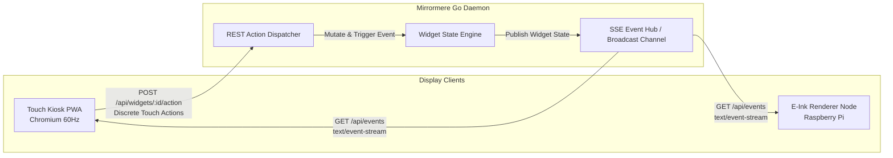

# SPEC-006: Realtime Communication & Mutation Protocol (SSE + REST)

## Status
Approved / Core Architectural Contract

## Context & Motivation
Mirrormere requires a communication protocol between the headless Go backend daemon and the various client display tiers (the 60Hz Chromium Touch Kiosk PWA and the low-power Raspberry Pi E-Ink display nodes).

While traditional dashboard projects frequently default to bidirectional WebSockets, Mirrormere intentionally adopts a **Command-Query Responsibility Segregation (CQRS)** pattern:
- **Server → Client (Query / State Push)**: Unidirectional **Server-Sent Events (SSE)**.
- **Client → Server (Command / Touch Actions)**: Standard **REST Endpoints (`POST`)**.

---

## Architectural Rationale: Why SSE + REST



### 1. Natural Protocol Separation
- Bidirectional WebSockets require custom application-level framing protocols (e.g. `{ "type": "action", "payload": ... }` vs `{ "type": "event", ... }`), re-implementing error handling, status codes, and routing over raw frames.
- SSE + REST splits concerns cleanly:
  - **Commands (Mutations)** use standard HTTP semantics (`200 OK`, `202 Accepted`, `400 Bad Request`, `502 Bad Gateway`).
  - **Queries (State Streams)** use native HTTP streaming over standard port 80/443.

### 2. Zero External Go Dependencies
- SSE requires zero third-party packages in Go. It is implemented purely with the standard library `net/http` package via the standard `http.Flusher` interface.
- WebSockets require heavy external dependencies (`nhooyr.io/websocket` or `gorilla/websocket`), socket connection pools, and custom ping/pong keep-alives.

### 3. Native Browser Resilience
- The browser's native `EventSource` API handles connection lifecycle automatically:
  - Auto-reconnect with exponential backoff on network dropouts.
  - Transparent state resumption via the `Last-Event-ID` header.
  - Zero client-side JavaScript libraries required.

### 4. Lightweight E-Ink and Headless Consumption
- A Python script or minimal Go binary on an ambient Raspberry Pi (e.g. Pi 3 B+ or Pi 4B) can consume SSE by reading line-by-line from a persistent HTTP request without asyncio event loops or complex WebSocket runtimes.

### 5. Proxy & Network Transparency
- SSE runs over standard HTTP/1.1 or HTTP/2. It passes smoothly through Cloudflare Tunnels, Tailscale, Nginx, Envoy, and Home Assistant Ingress without hitting 60-second WebSocket upgrade timeouts or proxy termination issues.

---

## Server-Sent Events (SSE) Specification

### 1. Connection Endpoint
- **URL**: `GET /api/events`
- **Headers**:
  ```http
  Accept: text/event-stream
  Cache-Control: no-cache
  Connection: keep-alive
  ```
- **Response Headers**:
  ```http
  HTTP/1.1 200 OK
  Content-Type: text/event-stream; charset=utf-8
  Cache-Control: no-cache
  Connection: keep-alive
  X-Accel-Buffering: no
  ```

### 2. Event Types & Wire Schemas

All messages follow standard SSE syntax: `event: <type>\nid: <id>\ndata: <json>\n\n`.

#### A. `widget.update`
Pushed when a data provider yields updated state (e.g. calendar fetch, weather refresh, or chore completion):
```http
event: widget.update
id: evt_1727216200_01
data: {"widget_id":"daily_chores","timestamp":"2026-09-24T22:15:00Z","data":{"tasks":[{"id":"t1","text":"Take out compost","completed":true},{"id":"t2","text":"Feed cat","completed":false}]}}
```

#### B. `screen.rotate`
Emitted by the Go rotation engine when the active screen advances to the next 6×2 layout:
```http
event: screen.rotate
id: evt_1727216230_02
data: {"current_screen":1,"total_screens":2,"interval_seconds":30,"widgets":[{"name":"photo_carousel","origin":[0,0],"dimensions":[3,2]},{"name":"home_assistant","origin":[3,0],"dimensions":[3,2]}]}
```

#### C. `system.status`
Emitted on system-level changes (backend sync health, Wi-Fi connectivity, or sensor telemetry):
```http
event: system.status
id: evt_1727216260_03
data: {"online":true,"time":"2026-09-24T22:15:20Z","home_assistant":"connected","weather_api":"ok"}
```

#### D. `video.state`
Emitted whenever the video priority stack mutates (stream trigger, doorbell interruption, or dismissal per SPEC-004):
```http
event: video.state
id: evt_1727216290_04
data: {"mode":"video","primary":{"id":"doorbell","stream_url":"http://homeassistant:1984/doorbell","type":"webrtc","timeout_seconds":45},"pip":{"id":"chromecast","stream_url":"http://127.0.0.1:1984/cast","type":"webrtc"}}
```

#### E. `voice.state`
Emitted whenever the voice interaction pipeline state changes (wake word detection, listening, transcription, agent thinking, or TTS reply):
```http
event: voice.state
id: evt_1727216300_05
data: {"state":"idle","transcript":null,"reply":null,"tts_engine":null}
```

#### F. Keep-Alive Heartbeat
The server writes an empty comment line `: ping` or event every 15–30 seconds to prevent reverse proxy idle timeouts:
```http
: ping 1727216320
```

---

### 3. Connection Handshake & Initial State Hydration

When a client establishes an SSE connection to `GET /api/events`:
- **Resumption with `Last-Event-ID`**: If the request includes a valid `Last-Event-ID` header and the missed events are present in the server's in-memory ring buffer (default retention: 5 minutes / 1,000 events), the server replays only the missed events in sequence.
- **Initial Connection / Cache Expiry Hydration**: If `Last-Event-ID` is omitted, blank, or expired, the server **immediately flushes an initial state hydration batch** before streaming live events. This guarantees that cold-booting kiosks, reloaded browser PWAs, and newly booted ambient e-ink nodes never render a blank canvas while waiting for subsequent background poll cycles:

1. **Current Screen Configuration (`screen.rotate`)**:
   Immediately emits the currently active screen index, total screen count, rotation interval, and widget layout positions.
   ```http
   event: screen.rotate
   id: evt_init_01
   data: {"current_screen":0,"total_screens":2,"interval_seconds":30,"widgets":[{"name":"daily_chores","origin":[0,0],"dimensions":[3,2]},{"name":"calendar_agenda","origin":[3,0],"dimensions":[3,2]}]}
   ```

2. **Active Widget State Hydration (`widget.update`)**:
   Immediately emits a `widget.update` event for every widget on the active screen (sourced from each provider's last known good cache snapshot in memory or SQLite).
   ```http
   event: widget.update
   id: evt_init_02
   data: {"widget_id":"daily_chores","timestamp":"2026-09-24T22:15:00Z","data":{"tasks":[{"id":"t1","text":"Take out compost","completed":true}]}}
   ```

3. **Active Video Pipeline State (`video.state`)**:
   Flushes the current video presentation state (idle widget display vs active primary cast/camera and optional PiP window).
   ```http
   event: video.state
   id: evt_init_03
   data: {"mode":"widgets","primary":null,"pip":null}
   ```

4. **Active Voice Pipeline State (`voice.state`)**:
   Flushes the current voice state to hydrate microphone indicators and status badges immediately.
   ```http
   event: voice.state
   id: evt_init_04
   data: {"state":"idle","transcript":null,"reply":null,"tts_engine":null}
   ```

5. **System Health Status (`system.status`)**:
   Flushes connectivity and upstream integration health.
   ```http
   event: system.status
   id: evt_init_05
   data: {"online":true,"time":"2026-09-24T22:15:20Z","home_assistant":"connected","weather_api":"ok"}
   ```

Following the initial state hydration burst, the stream transitions seamlessly to live real-time event broadcasting and periodic keep-alive pings.

---

## Client Touch Mutation & Video Action Specification

### 1. Widget Mutation Endpoint
- **URL**: `POST /api/widgets/{widget_id}/action`
- **Headers**:
  ```http
  Content-Type: application/json
  Accept: application/json
  ```
- **Payload Schema**:
  ```json
  {
    "action": "toggle_task",
    "params": {
      "task_id": "t1",
      "completed": true
    }
  }
  ```

### 2. Video Stream Lifecycle Endpoints
- **Trigger Stream**: `POST /api/video/trigger`
  - **Payload**:
    ```json
    {
      "id": "chromecast",
      "stream_url": "http://127.0.0.1:1984/cast",
      "type": "webrtc",
      "priority": "persistent",
      "timeout_seconds": 0
    }
    ```
- **Dismiss Stream**: `POST /api/video/dismiss`
  - **Payload**:
    ```json
    {
      "id": "chromecast"
    }
    ```

### 3. Screen Navigation & Rotation Endpoints

#### A. Select Screen (`POST /api/screen/select`)
Selects a specific screen directly by zero-based index:
- **Headers**:
  ```http
  Content-Type: application/json
  Accept: application/json
  ```
- **Request Payload**:
  ```json
  {
    "screen_index": 1
  }
  ```
  - `screen_index` (integer, required): 0-indexed screen number (`0 <= screen_index < total_screens`).
- **Response (`200 OK`)**:
  ```json
  {
    "status": "ok",
    "current_screen": 1,
    "total_screens": 2
  }
  ```
- **Error Response (`400 Bad Request`)**:
  ```json
  {
    "status": "error",
    "error": "invalid screen_index: must be between 0 and total_screens - 1"
  }
  ```
- **Side Effects**: Switches the active screen layout immediately, resets the automatic rotation interval countdown, and broadcasts a `screen.rotate` SSE event.

#### B. Advance Screen (`POST /api/screen/advance`)
Advances the active screen sequentially (designed for single-button hardware triggers or sequential gesture navigations):
- **Headers**:
  ```http
  Content-Type: application/json
  Accept: application/json
  ```
- **Request Payload** (optional or empty `{}`):
  ```json
  {
    "direction": "next"
  }
  ```
  - `direction` (string, optional, default `"next"`): Either `"next"` to advance forward `(current_screen + 1) % total_screens`, or `"prev"` to advance backward `(current_screen - 1 + total_screens) % total_screens`.
- **Response (`200 OK`)**:
  ```json
  {
    "status": "ok",
    "current_screen": 1,
    "total_screens": 2
  }
  ```
- **Side Effects**: Advances the active screen in the requested direction, resets the automatic rotation countdown, and broadcasts a `screen.rotate` SSE event.

#### C. Pause / Resume Rotation (`POST /api/screen/pause`)
Controls the automatic rotation timer loop:
- **Headers**:
  ```http
  Content-Type: application/json
  Accept: application/json
  ```
- **Request Payload**:
  ```json
  {
    "paused": true
  }
  ```
  - `paused` (boolean, required): `true` to pause automatic rotation; `false` to resume automatic rotation.
- **Response (`200 OK`)**:
  ```json
  {
    "status": "ok",
    "paused": true,
    "current_screen": 0
  }
  ```
- **Error Response (`400 Bad Request`)**:
  ```json
  {
    "status": "error",
    "error": "invalid payload: paused must be a boolean"
  }
  ```
- **Side Effects**:
  - `paused: true`: Suspends the automatic rotation timer loop; the display remains indefinitely on the active screen until explicitly advanced or unpaused.
  - `paused: false`: Re-arms the rotation timer using `interval_seconds` and resumes periodic rotation.

### 4. Standard Responses
- **`200 OK`**: Action executed immediately and state updated.
  ```json
  { "status": "ok", "widget_id": "daily_chores", "result": { "task_id": "t1", "completed": true } }
  ```
- **`202 Accepted`**: Action dispatched asynchronously to an external system (e.g. Home Assistant service call).
- **`400 Bad Request`**: Unknown action or invalid parameter schema.
- **`404 Not Found`**: Widget or stream ID not loaded in active configuration.
- **`502 Bad Gateway`**: Upstream provider (e.g. Google API, Home Assistant) failed.

### 5. Optimistic UI Updates on Touch Kiosks
1. User taps a chore checkbox on the 1080p capacitive touch display.
2. The Touch PWA immediately flips the visual checkbox state locally (< 16ms, 60fps responsiveness).
3. The PWA dispatches `POST /api/widgets/daily_chores/action`.
4. If the server returns success, the subsequent `widget.update` SSE message reconciles state seamlessly.
5. If the request fails (e.g. network partition), the PWA rolls back the optimistic visual state with an error toast.

---

## Display Profile Consumption Details

### Touch Kiosk (Profile A - 60Hz Interactive)
- PWA maintains a long-lived `EventSource` connection to `/api/events`.
- In-memory reactive state tree updates instantly on `widget.update`.
- Smooth slide/flip animation triggers on `screen.rotate`.
- Touch swipe gestures reset/pause the rotation timer locally, sending a `POST /api/screen/pause` or `POST /api/screen/select` if desired.

### Ambient E-Ink (Profile B - Low-Power / E-Paper)
- In the decoupled setup (e.g. Pi 3 B+ display node + amos-pi rendering hub):
  - The rendering node connects to `/api/events`.
  - Re-rendering of the static 800×480 monochrome image occurs only on `screen.rotate` or when relevant widget state changes.
  - The display Pi downloads the pre-rendered image on trigger, completely insulating the e-paper panel from useless high-frequency refreshes.
