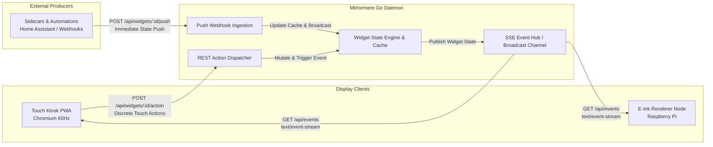

# SPEC-006: Realtime Communication & Mutation Protocol (SSE + REST)

## Status
Approved / Core Architectural Contract

## Context & Motivation
Mirrormere requires a communication protocol between the headless Go backend daemon and the various client display tiers (the 60Hz Chromium Touch Kiosk PWA and the low-power Raspberry Pi E-Ink display nodes).

While traditional dashboard projects frequently default to bidirectional WebSockets, Mirrormere intentionally adopts a **Command-Query Responsibility Segregation (CQRS)** pattern:
- **Server → Client (Query / State Push)**: Unidirectional **Server-Sent Events (SSE)**.
- **Client → Server (Command / Touch Actions)**: Standard **REST Endpoints (`POST`)**.

---

## Architectural Rationale: Why SSE + REST



### 1. Natural Protocol Separation
- Bidirectional WebSockets require custom application-level framing protocols (e.g. `{ "type": "action", "payload": ... }` vs `{ "type": "event", ... }`), re-implementing error handling, status codes, and routing over raw frames.
- SSE + REST splits concerns cleanly:
  - **Commands (Mutations)** use standard HTTP semantics (`200 OK`, `202 Accepted`, `400 Bad Request`, `502 Bad Gateway`).
  - **Queries (State Streams)** use native HTTP streaming over standard port 80/443.

### 2. Zero External Go Dependencies
- SSE requires zero third-party packages in Go. It is implemented purely with the standard library `net/http` package via the standard `http.Flusher` interface.
- WebSockets require heavy external dependencies (`nhooyr.io/websocket` or `gorilla/websocket`), socket connection pools, and custom ping/pong keep-alives.

### 3. Native Browser Resilience
- The browser's native `EventSource` API handles connection lifecycle automatically:
  - Auto-reconnect with exponential backoff on network dropouts.
  - Transparent state resumption via the `Last-Event-ID` header.
  - Zero client-side JavaScript libraries required.

### 4. Lightweight E-Ink and Headless Consumption
- A Python script or minimal Go binary on an ambient Raspberry Pi (e.g. Pi 4B) can consume SSE by reading line-by-line from a persistent HTTP request without asyncio event loops or complex WebSocket runtimes.

### 5. Proxy & Local Network Transparency
- SSE runs over standard HTTP/1.1 or HTTP/2. It passes smoothly through local reverse proxies (Nginx, Caddy, Envoy, and Home Assistant Ingress) without hitting 60-second WebSocket upgrade timeouts or proxy termination issues.

---

## Server-Sent Events (SSE) Specification

### 1. Connection Endpoint
- **URL**: `GET /api/events`
- **Headers**:
  ```http
  Accept: text/event-stream
  Cache-Control: no-cache
  Connection: keep-alive
  ```
- **Response Headers**:
  ```http
  HTTP/1.1 200 OK
  Content-Type: text/event-stream; charset=utf-8
  Cache-Control: no-cache
  Connection: keep-alive
  X-Accel-Buffering: no
  ```

### 2. Event Types & Wire Schemas

All messages follow standard SSE syntax: `event: <type>\nid: <id>\ndata: <json>\n\n`.

#### A. `widget.update`
Pushed when a data provider yields updated state (e.g. calendar fetch, weather refresh, or chore completion):
```http
event: widget.update
id: evt_1727216200_01
data: {"widget_id":"daily-chores","timestamp":"2026-09-24T22:15:00Z","state":"healthy","data":{"list":{"id":"chores","name":"Chores","source":"gtasks"},"items":[{"id":"i1","title":"Take out compost","done":true,"position":0},{"id":"i2","title":"Feed cat","done":false,"position":1}]}}
```

#### B. `header.update`
Pushed when the autonomous header weather poller completes an ingestion cycle (SPEC-007 §4), delivering persistent top-banner weather directly to all connected displays without requiring an on-grid weather widget:
```http
event: header.update
id: evt_1727216215_02
data: {"timestamp":"2026-09-24T22:15:00Z","weather":{"temperature":68.5,"units":"F","weather_code":1,"icon":"weather-sunny"}}
```

#### C. `screen.rotate`
Emitted by the Go rotation engine when the active screen advances to the next 6×2 layout:
```http
event: screen.rotate
id: evt_1727216230_03
data: {"current_screen":1,"total_screens":2,"interval_seconds":30,"widgets":[{"widget_id":"photo-carousel","origin":[0,0],"dimensions":[3,2]},{"widget_id":"family-calendar","origin":[3,0],"dimensions":[3,2]}]}
```

#### D. `system.status`
Emitted on system-level changes (backend sync health, Wi-Fi connectivity, or sensor telemetry):
```http
event: system.status
id: evt_1727216260_04
data: {"online":true,"time":"2026-09-24T22:15:20Z","calendar_provider":"connected","weather_api":"ok"}
```

#### E. `video.state`
Emitted whenever the video priority stack mutates or player transport changes (stream trigger, doorbell interruption, play/pause, or dismissal per SPEC-004):
```http
event: video.state
id: evt_1727216290_05
data: {"mode":"video","primary":{"id":"chromecast","stream_url":"http://127.0.0.1:1984/cast","type":"webrtc","player_state":"playing","controllable":true},"pip":{"id":"doorbell","stream_url":"http://homeassistant:1984/doorbell","type":"webrtc","muted":true,"timeout_seconds":45}}
```

#### F. `audio.state`
Emitted whenever host audio volume or mute state mutates:
```http
event: audio.state
id: evt_1727216295_06
data: {"volume":75,"muted":false}
```

#### G. `voice.state`
Emitted whenever the voice interaction pipeline state changes (wake word detection, listening, transcription, agent thinking, or TTS reply):
```http
event: voice.state
id: evt_1727216300_07
data: {"state":"idle","transcript":null,"reply":null,"tts_engine":null}
```

#### H. `widget.reload`
Emitted when the in-process `fsnotify` file watcher detects a template update in `/config/widgets/<widget-type>/views/widget.html` or `/app/widgets/<widget-type>/views/widget.html`:
```http
event: widget.reload
id: evt_1727216300_08
data: {"type":"sensor-card"}
```
Connected display clients receive this event and immediately patch the target widget's DOM tree (or trigger a clean page reload) with zero manual screen interaction.

#### I. `style.reload`
Emitted when the in-process `fsnotify` file watcher detects an update to the volume-mounted custom stylesheet (`/config/custom.css`):
```http
event: style.reload
id: evt_1727216300_09
data: {"file":"custom.css","timestamp":"2026-09-25T19:40:00Z"}
```
Connected browser clients hot-swap the stylesheet `<link>` tag's `href` with a cache-busting timestamp parameter (`/style.css?t=Date.now()`), restyling the UI live with zero visual flicker.

#### J. Keep-Alive Heartbeat
The server writes an empty comment line `: ping` or event every 15–30 seconds to prevent reverse proxy idle timeouts:
```http
: ping 1727216320
```

---

### 3. Connection Handshake & Initial State Hydration

When a client establishes an SSE connection to `GET /api/events`:
- **Resumption with `Last-Event-ID`**: If the request includes a valid `Last-Event-ID` header and the missed events are present in the server's in-memory ring buffer (default retention: 5 minutes / 1,000 events), the server replays only the missed events in sequence.
- **Initial Connection / Cache Expiry Hydration**: If `Last-Event-ID` is omitted, blank, or expired, the server **immediately flushes an initial state hydration batch** before streaming live events. This guarantees that cold-booting kiosks, reloaded browser PWAs, and newly booted ambient e-ink nodes never render a blank canvas while waiting for subsequent background poll cycles:

1. **Current Screen Configuration (`screen.rotate`)**:
   Immediately emits the currently active screen index, total screen count, rotation interval, and widget layout positions.
   ```http
   event: screen.rotate
   id: evt_init_01
   data: {"current_screen":0,"total_screens":2,"interval_seconds":30,"widgets":[{"widget_id":"daily-chores","origin":[0,0],"dimensions":[3,2]},{"widget_id":"family-calendar","origin":[3,0],"dimensions":[3,2]}]}
   ```

2. **Full Widget State Hydration (`widget.update`)**:
   Immediately emits a `widget.update` event for every widget configured in `display.widgets` across all screens (sourced from each provider's last known good cache snapshot in memory or SQLite). This guarantees that client DOM caches are fully primed so that subsequent screens render instantaneously with zero blank flashes on rotation.
   ```http
   event: widget.update
   id: evt_init_02
   data: {"widget_id":"daily-chores","timestamp":"2026-09-24T22:15:00Z","state":"healthy","data":{"list":{"id":"chores","name":"Chores","source":"gtasks"},"items":[{"id":"i1","title":"Take out compost","done":true,"position":0}]}}
   ```

3. **Fixed Header Ambient Weather (`header.update`)**:
   Flushes the current ambient weather conditions for the persistent top banner.
   ```http
   event: header.update
   id: evt_init_03
   data: {"timestamp":"2026-09-24T22:15:00Z","weather":{"temperature":68.5,"units":"F","weather_code":1,"icon":"weather-sunny"}}
   ```

4. **Active Video Pipeline State (`video.state`)**:
   Flushes the current video presentation state (idle widget display vs active primary cast/camera and optional PiP window).
   ```http
   event: video.state
   id: evt_init_04
   data: {"mode":"widgets","primary":null,"pip":null}
   ```

5. **Active Audio State (`audio.state`)**:
   Flushes the current master volume level and mute state.
   ```http
   event: audio.state
   id: evt_init_05
   data: {"volume":75,"muted":false}
   ```

6. **Active Voice Pipeline State (`voice.state`)**:
   Flushes the current voice state to hydrate microphone indicators and status badges immediately.
   ```http
   event: voice.state
   id: evt_init_06
   data: {"state":"idle","transcript":null,"reply":null,"tts_engine":null}
   ```

7. **System Health Status (`system.status`)**:
   Flushes connectivity and upstream integration health.
   ```http
   event: system.status
   id: evt_init_07
   data: {"online":true,"time":"2026-09-24T22:15:20Z","calendar_provider":"connected","weather_api":"ok"}
   ```

Following the initial state hydration burst, the stream transitions seamlessly to live real-time event broadcasting and periodic keep-alive pings.

---

## Inbound Mutations, Video Actions & Push Webhooks

### 1. Widget Mutation Endpoint
- **URL**: `POST /api/widgets/{widget_id}/action`
- **Headers**:
  ```http
  Content-Type: application/json
  Accept: application/json
  ```
- **Payload Schema**:
  ```json
  {
    "action": "trigger_calibration",
    "params": {
      "sensor_id": "air-quality-co2",
      "baseline_ppm": 420
    }
  }
  ```
  *(Supported actions and parameter schemas conform to the target widget's specification, e.g. custom provider actions or trigger webhooks. Read-only widgets such as calendar-agenda, weather-forecast, and tasks reject action requests with `400 Bad Request`).*

### 2. Widget State Snapshot Endpoint (`GET /api/widgets/{widget_id}/state`)
Retrieves the latest cached state snapshot for a single widget on demand (useful for initial component mounting, deep-link widget refreshes, or headless scripts outside the SSE push stream):
- **URL**: `GET /api/widgets/{widget_id}/state`
- **Headers**:
  ```http
  Accept: application/json
  ```
- **Response (`200 OK`)**:
  ```json
  {
    "widget_id": "custom-sensor-hud",
    "timestamp": "2026-09-24T22:20:00Z",
    "state": "healthy",
    "data": {
      "co2_ppm": 640,
      "temperature_f": 71.2,
      "humidity_pct": 45,
      "air_quality": "good"
    }
  }
  ```
- **Error Response (`404 Not Found`)**:
  ```json
  {
    "status": "error",
    "error": "widget 'custom-sensor-hud' not found in active configuration"
  }
  ```

### 3. Widget Realtime Push Webhook Endpoint
External sidecars, local microservices, and Home Assistant automations can immediately push fresh data into Mirrormere without waiting for the widget's next background polling interval:
- **URL**: `POST /api/widgets/{widget_id}/push`
- **Headers**:
  ```http
  Content-Type: application/json
  Accept: application/json
  ```
- **Authentication**: None (Mirrormere runs strictly on local networks with zero authn/authz; all inbound LAN calls are fully trusted per the local-network trust model).
- **Scope & Source-of-Truth Guard**:
  - **HTTP & Sidecar Providers Only**: The push webhook is strictly limited to widgets whose data an external sidecar or custom HTTP provider owns (HTTP-provider widgets per SPEC-003 §3, such as `custom-sensor-hud` or indoor air quality monitors).
  - **List Widgets Protected (`409 Conflict`)**: List-backed widgets (`type: tasks`) are strictly read-only ambient surfaces ingesting state from upstream sources (Google Tasks, generic HTTP, or local store per SPEC-008). Pushing arbitrary item lists to `POST /api/widgets/{widget_id}/push` on a `tasks` widget circumvents provider ingestion, causes cache drift across consumer widgets (e.g. `compact-chores`), and would be overwritten on the next poll cycle.
  - Calling `POST /api/widgets/{widget_id}/push` on a `tasks` widget is rejected with **`409 Conflict`**.
- **Request Payload**:
  Conforms to the standard JSON payload envelope defined in SPEC-003:
  ```json
  {
    "widget_id": "custom-sensor-hud",
    "timestamp": "2026-09-24T22:20:00Z",
    "state": "healthy",
    "data": {
      "co2_ppm": 640,
      "temperature_f": 71.2,
      "humidity_pct": 45,
      "air_quality": "good"
    }
  }
  ```
  - `widget_id` (string, optional in body): If provided in the JSON body, it MUST match the `{widget_id}` in the URL path. If they differ, the server rejects the request with `400 Bad Request`.
  - `timestamp` (string, RFC 3339, optional): Timestamp of data snapshot; defaults to the server's current UTC arrival time if omitted.
  - `state` (string, optional, default `"healthy"`): `"healthy"` | `"degraded"` | `"error"`.
  - `data` (object, required): Widget-specific domain payload conforming to the widget type's schema. Missing or non-object `data` yields `400 Bad Request`.

- **Cache Ingestion & Realtime Broadcast Invariant**:
  - **Immediate Cache Ingestion**: The daemon validates the payload and updates the widget provider's in-memory state and persistent SQLite cache immediately, **regardless of whether the widget is currently visible on the active screen**.
  - **Unconditional SSE Broadcast**: The server immediately broadcasts a `widget.update` SSE event across all open `/api/events` connections, ensuring all connected displays, companion nodes, and cached client stores update their local state immediately without waiting for a rotation event or poll cycle. Inactive displays or hidden components update their local stores in background, guaranteeing instant 0ms rendering with zero flicker when switching or rotating screens.

- **Responses**:
  - **`200 OK`**: Push payload accepted, cache updated, and `widget.update` broadcast emitted to all SSE subscribers.
    ```json
    {
      "status": "ok",
      "widget_id": "custom-sensor-hud",
      "updated_at": "2026-09-24T22:20:00Z"
    }
    ```
  - **`400 Bad Request`**: Invalid JSON syntax, missing `data` object, or `widget_id` mismatch between path and body.
    ```json
    {
      "status": "error",
      "error": "payload widget_id 'living-room' does not match path widget_id 'custom-sensor-hud'"
    }
    ```
  - **`404 Not Found`**: Widget ID `{widget_id}` does not exist in the active server configuration.
    ```json
    {
      "status": "error",
      "error": "widget 'custom-sensor-hud' not found in active configuration"
    }
    ```
  - **`409 Conflict`**: Target widget is backed by a list/task provider (`type: tasks`).
    ```json
    {
      "status": "error",
      "error": "cannot push state to list-backed widget 'daily-chores'; task lists are read-only and ingested from configured upstream providers"
    }
    ```

### 4. Custom Widget Ingestion Polling Contract (`POST {endpoint}`)
When Mirrormere ingests data for custom widgets declared with `provider: http`, the Go daemon polls the configured `{endpoint}` on its declared `refresh_interval_seconds` cadence:

- **Method**: Standard `POST` (prevents reverse proxies, web frameworks, and client libraries from stripping request bodies, which commonly occurs with HTTP `GET`). An optional `method: GET` configuration is supported in `config.yaml` for simple parameterless IoT hardware (e.g. an ESP32 displaying a static `/status` page).
- **Headers**:
  ```http
  Content-Type: application/json
  Accept: application/json
  Authorization: Bearer <TOKEN>        (if token_env is configured)
  X-Widget-ID: living-room-temp
  X-Widget-Type: sensor-card
  X-Widget-Dimensions: 2x1
  ```
- **Request Body Sent TO Endpoint**:
  Mirrormere serializes the widget instance context and its full custom `config:` mapping:
  ```json
  {
    "widget_id": "living-room-temp",
    "widget_type": "sensor-card",
    "dimensions": [2, 1],
    "config": {
      "entity_id": "sensor.living_room_temp",
      "unit": "F"
    }
  }
  ```
  This allows a single multi-tenant sidecar (such as a Home Assistant bridge or database query runner) to power multiple widget instances dynamically without requiring its own routing table or separate configuration files.

- **Response Body Received FROM Endpoint (`200 OK`)**:
  Conforms to the standard JSON payload envelope:
  ```json
  {
    "widget_id": "living-room-temp",
    "timestamp": "2026-09-24T22:20:00Z",
    "state": "healthy",
    "data": {
      "temperature": 71.2
    }
  }
  ```
  On receipt, Mirrormere updates its in-memory and SQLite cache and broadcasts a `widget.update` SSE event across all connected displays.

### 5. Video Stream Lifecycle & Action Endpoints
- **Trigger Stream**: `POST /api/video/trigger`
  - **Payload**:
    ```json
    {
      "id": "chromecast",
      "stream_url": "http://127.0.0.1:1984/cast",
      "type": "webrtc",
      "priority": "persistent",
      "timeout_seconds": 0,
      "controllable": true,
      "control_url": "http://cast-watcher:8090/action"
    }
    ```
  - `control_url` (string, optional): HTTP webhook URL on the stream producer sidecar where Mirrormere Core forwards incoming client transport actions.
- **Dismiss Stream**: `POST /api/video/dismiss`
  - **Payload**:
    ```json
    {
      "id": "chromecast"
    }
    ```
- **Video Action & Transport Control**: `POST /api/video/action`
  - **Payload**:
    ```json
    {
      "id": "chromecast",
      "action": "toggle_playback",
      "value": null
    }
    ```
  - Controls playback state on active controllable streams (SPEC-004). When received, Core verifies `controllable: true` and forwards the action payload directly via HTTP POST to `{control_url}` (returning `200 OK` on forward success, `502 Bad Gateway` on controller failure, or `422 Unprocessable Entity` if non-controllable).
- **Player State Update**: `POST /api/video/state`
  - **Payload**:
    ```json
    {
      "id": "chromecast",
      "player_state": "playing"
    }
    ```
  - Dispatched by the stream producer sidecar (e.g. `sidecars/cast-watcher`) when player transport state changes (`"playing"`, `"paused"`, or `"buffering"`). Core updates the active stream record and broadcasts an updated `video.state` SSE event to synchronize all connected displays.

### 6. Master Audio Volume & Mute Endpoints
Mirrormere Core acts as the centralized coordinator for master audio volume and mute state, tracking desired values and synchronizing connected clients. To avoid fragile host-level dependencies, permissions, or split-brain attenuation layers, volume and muting are managed entirely in software at the application/client level rather than relying on host-level OS settings (`wpctl` or PipeWire socket bind-mounts):
- **Centralized State Coordination**: Core maintains authoritative in-memory `volume` (0–100) and `muted` (boolean) state, broadcasting changes immediately across `GET /api/events` as `audio.state` SSE events.
- **Client-Side Software Enforcement**: Active display clients (e.g. Chromium running in `--kiosk` mode under Wayland `cage` per SPEC-010) or edge voice companions subscribe to `audio.state` and apply digital attenuation directly to their HTML5 `<video>` / WebRTC playback elements.
- **80% Software Ceiling**: To protect small monitor chassis speakers from distortion or driver burnout, the client software maps the 0–100 master volume to a maximum 80% element volume ceiling:
  ```javascript
  element.volume = (volume / 100) * 0.80 * (isDucked ? 0.2 : 1.0) * (isMuted ? 0.0 : 1.0);
  ```
- **Zero Host Coupling & Single Attenuation Layer**: The Linux host audio sink remains set to its standard system level and is never manipulated by Mirrormere. This guarantees container hermeticity, eliminates double-attenuation bugs, and works identically across bare metal, Docker, and remote browser testing.

#### A. Set Master Volume (`POST /api/audio/volume`)
Sets the master audio volume level:
- **Headers**:
  ```http
  Content-Type: application/json
  Accept: application/json
  ```
- **Request Payload**:
  ```json
  {
    "volume": 75
  }
  ```
  - `volume` (integer, required): Master volume percentage between `0` and `100` inclusive.
- **Response (`200 OK`)**:
  ```json
  {
    "status": "ok",
    "volume": 75,
    "muted": false
  }
  ```
- **Error Response (`400 Bad Request`)**:
  ```json
  {
    "status": "error",
    "error": "invalid volume: must be an integer between 0 and 100"
  }
  ```
- **Side Effects**: Updates Core's in-memory audio state and broadcasts an `audio.state` SSE event to synchronize all connected displays and companion controllers.

#### B. Set / Toggle Master Mute (`POST /api/audio/mute`)
Sets or toggles the host master audio mute state:
- **Headers**:
  ```http
  Content-Type: application/json
  Accept: application/json
  ```
- **Request Payload** (optional or empty `{}`):
  ```json
  {
    "muted": true
  }
  ```
  - `muted` (boolean, optional): Explicit target mute state (`true` to mute, `false` to unmute). If omitted or empty `{}`: toggles current mute state.
- **Response (`200 OK`)**:
  ```json
  {
    "status": "ok",
    "muted": true,
    "volume": 75
  }
  ```
- **Error Response (`400 Bad Request`)**:
  ```json
  {
    "status": "error",
    "error": "invalid payload: muted must be a boolean"
  }
  ```
- **Side Effects**: Updates Core's in-memory mute state, broadcasts an `audio.state` SSE event to all connected displays, and (if co-located PipeWire integration is mounted) sets host sink mute.

#### C. Get Audio State (`GET /api/audio`)
Returns the current master volume and mute state:
- **Headers**:
  ```http
  Accept: application/json
  ```
- **Response (`200 OK`)**:
  ```json
  {
    "status": "ok",
    "volume": 75,
    "muted": false
  }
  ```

### 7. Voice Pipeline State Relay Endpoint (`POST /api/voice/state`)
The edge voice companion daemon (`mirrormere-voice` per SPEC-011) relays interaction lifecycle events to Mirrormere Core to synchronize on-screen microphone indicators and caption toasts:
- **Endpoint**: `POST /api/voice/state`
- **Authentication**: None (all inbound LAN calls are fully trusted per the local-network trust model).
- **Request Headers**:
  ```http
  Content-Type: application/json
  Accept: application/json
  ```
- **Request Body Schema**:
  ```json
  {
    "state": "thinking",
    "transcript": "What time is Alex's next meeting?",
    "reply": null,
    "tts_engine": null
  }
  ```
  - `state` (string, required): Active voice lifecycle state. Must be one of `"idle"`, `"listening"`, `"transcribing"`, `"thinking"`, `"synthesizing"`, `"speaking"`, or `"error"`.
  - `transcript` (string or null, optional): Recognized user utterance returned by STT. Null when idle or listening before transcription completes.
  - `reply` (string or null, optional): Assistant reply text returned by the brain. Rendered as caption toasts on interactive kiosks (SPEC-010, SPEC-011).
  - `tts_engine` (string or null, optional): Name of the active TTS engine synthesizing or speaking audio (e.g. `"kokoro"`, `"elevenlabs"`, `"piper"`).
- **Behavior & Rebroadcast Invariant**:
  - Updates Core's in-memory voice state cache.
  - Immediately rebroadcasts the updated state across `GET /api/events` as a `voice.state` SSE event (Section 2.G) to synchronize all connected display clients.
  - Hydrates new clients connecting to `GET /api/events` during initial state hydration (Section 3).
- **Responses**:
  - `200 OK`:
    ```json
    {
      "status": "ok"
    }
    ```
  - `400 Bad Request`:
    ```json
    {
      "status": "error",
      "error": "invalid voice state: must be one of 'idle', 'listening', 'transcribing', 'thinking', 'synthesizing', 'speaking', 'error'"
    }
    ```

### 8. Household List Inspection Endpoint (`GET /api/lists/{list_id}/items`)

Direct list inspection enables mobile companion apps, headless automation scripts, and voice pipelines to inspect household lists (groceries, chores, todo items) directly by canonical `list_id`, without requiring or coupling to a visible widget on screen (per SPEC-008). Because Mirrormere operates as a strictly read-only ambient display for tasks, no list mutation endpoints (`POST`, `PATCH`, `DELETE`) exist; list modifications are made upstream at the source of truth.

#### Get List Items (`GET /api/lists/{list_id}/items`)
Retrieves all current items for a specific list from the local cache:
- **Headers**:
  ```http
  Accept: application/json
  ```
- **Query Parameters**:
  - `include_done` (boolean, optional, default `true`): If `false`, filters out completed items.
- **Response (`200 OK`)**:
  ```json
  [
    {
      "id": "i1",
      "list_id": "groceries",
      "title": "Oat milk",
      "done": false,
      "section": "Dairy",
      "position": 0,
      "assignee": null,
      "due_date": null,
      "created_at": "2026-09-24T22:00:00Z",
      "updated_at": "2026-09-24T22:30:00Z"
    }
  ]
  ```
- **Error Response (`404 Not Found`)**:
  ```json
  {
    "status": "error",
    "error": "list 'groceries' not found"
  }
  ```

### 9. Screen Navigation & Rotation Endpoints

#### A. Select Screen (`POST /api/screen/select`)
Selects a specific screen directly by zero-based index:
- **Headers**:
  ```http
  Content-Type: application/json
  Accept: application/json
  ```
- **Request Payload**:
  ```json
  {
    "screen_index": 1
  }
  ```
  - `screen_index` (integer, required): 0-indexed screen number (`0 <= screen_index < total_screens`).
- **Response (`200 OK`)**:
  ```json
  {
    "status": "ok",
    "current_screen": 1,
    "total_screens": 2
  }
  ```
- **Error Response (`400 Bad Request`)**:
  ```json
  {
    "status": "error",
    "error": "invalid screen_index: must be between 0 and total_screens - 1"
  }
  ```
- **Side Effects**: Switches the active screen layout immediately, resets the automatic rotation interval countdown, and broadcasts a `screen.rotate` SSE event.

#### B. Advance Screen (`POST /api/screen/advance`)
Advances the active screen sequentially (designed for single-button hardware triggers or sequential gesture navigations):
- **Headers**:
  ```http
  Content-Type: application/json
  Accept: application/json
  ```
- **Request Payload** (optional or empty `{}`):
  ```json
  {
    "direction": "next"
  }
  ```
  - `direction` (string, optional, default `"next"`): Either `"next"` to advance forward `(current_screen + 1) % total_screens`, or `"prev"` to advance backward `(current_screen - 1 + total_screens) % total_screens`.
- **Response (`200 OK`)**:
  ```json
  {
    "status": "ok",
    "current_screen": 1,
    "total_screens": 2
  }
  ```
- **Side Effects**: Advances the active screen in the requested direction, resets the automatic rotation countdown, and broadcasts a `screen.rotate` SSE event.

#### C. Pause / Resume Rotation (`POST /api/screen/pause`)
Controls the automatic rotation timer loop:
- **Headers**:
  ```http
  Content-Type: application/json
  Accept: application/json
  ```
- **Request Payload**:
  ```json
  {
    "paused": true,
    "duration_seconds": 120
  }
  ```
  - `paused` (boolean, required): `true` to pause automatic rotation; `false` to resume automatic rotation.
  - `duration_seconds` (integer, optional): When pausing (`paused: true`), specifies the number of seconds to suspend rotation before Core automatically unpauses and resumes. If omitted, defaults to configured `rotation.pause_duration_seconds` (e.g. 120). If explicitly set to `0`, rotation remains paused indefinitely until explicitly unpaused.
- **Response (`200 OK`)**:
  ```json
  {
    "status": "ok",
    "paused": true,
    "current_screen": 0
  }
  ```
- **Error Response (`400 Bad Request`)**:
  ```json
  {
    "status": "error",
    "error": "invalid payload: paused must be a boolean"
  }
  ```
- **Side Effects**:
  - `paused: true`: Suspends the automatic rotation timer loop for `duration_seconds` (or indefinitely if set to 0). Core auto-resumes periodic rotation once the timer elapses.
  - `paused: false`: Re-arms the rotation timer using `interval_seconds` and immediately resumes periodic rotation.

### 10. Standard Responses
- **`200 OK`**: Action executed immediately, push webhook accepted and cached, or audio settings changed:
  ```json
  { "status": "ok", "widget_id": "indoor-air-quality", "result": { "calibrated": true } }
  ```
  ```json
  { "status": "ok", "widget_id": "custom-sensor-hud", "updated_at": "2026-09-24T22:20:00Z" }
  ```
  ```json
  { "status": "ok", "volume": 75, "muted": false }
  ```
- **`202 Accepted`**: Action dispatched asynchronously to an external system (e.g. out-of-process generic HTTP provider background operation).
- **`400 Bad Request`**: Unknown action, invalid parameter schema, malformed payload envelope, or path/body ID mismatch.
- **`404 Not Found`**: Widget ID, list ID, or stream ID not found.
- **`409 Conflict`**: Mutation rejected due to source-of-truth invariants (e.g. attempting `push` on a list-backed widget).
- **`422 Unprocessable Entity`**: Payload syntactically valid but cannot be processed by the target resource state (e.g. stream is not controllable, or missing `control_url` for transport control).
- **`502 Bad Gateway`**: Upstream provider (e.g. out-of-process HTTP service or Cast socket) failed or unreachable.

### 11. Optimistic UI Updates on Touch Kiosks
1. User interacts with touch controls on the 1080p capacitive touch display—such as tapping a HUD play/pause button, dragging the master volume slider, or toggling mute (note: task list widgets are ambient and read-only, avoiding optimistic task state reconciliation).
2. The Touch PWA immediately flips the visual state locally (< 16ms, 60fps responsiveness).
3. The PWA dispatches the respective REST endpoint (`POST /api/widgets/{widget_id}/action`, `POST /api/video/action`, `POST /api/audio/volume`, or `POST /api/audio/mute`).
4. When the server processes the command, the corresponding SSE event (`widget.update`, `video.state`, or `audio.state`) reconciles authoritative state across all connected clients.
5. If the request fails (e.g. network partition or upstream error), the PWA rolls back the optimistic visual state with an error toast.

---

## Display Profile Consumption Details

### Touch Kiosk (Profile A - 60Hz Interactive)
- PWA maintains a long-lived `EventSource` connection to `/api/events`.
- In-memory reactive state tree updates instantly on `widget.update`.
- Smooth slide/flip animation triggers on `screen.rotate`.
- Touch swipe gestures pause the server's rotation timer by dispatching `POST /api/screen/pause` (with `duration_seconds` matching `rotation.pause_duration_seconds`), or navigate directly via `POST /api/screen/select` or `POST /api/screen/advance`.

### Ambient E-Ink (Profile B - Low-Power / E-Paper)
- On the single-host Pi 4B setup (or in a decoupled multi-host deployment):
  - The local `clients/eink-node` daemon (or remote client) connects to `/api/events` (`http://localhost:8080/api/events`).
  - Headless Chromium (`eink-renderer`) rasterizes the static 800×480 monochrome buffer on request when the display node fetches `GET /eink.png` (SPEC-003 §4 and SPEC-009).
  - The display client (`clients/eink-node`) fetches `http://localhost:8081/eink.png` when triggered by `widget.update`, `screen.rotate`, or periodic clock tick (`clock_refresh_seconds`), coalesces rapid events, and flushes over SPI, completely insulating the e-paper panel from useless high-frequency refreshes.
