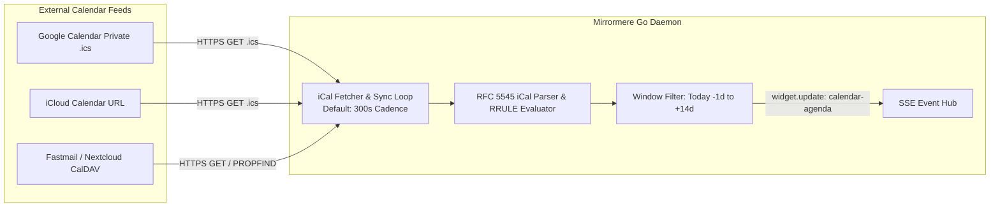
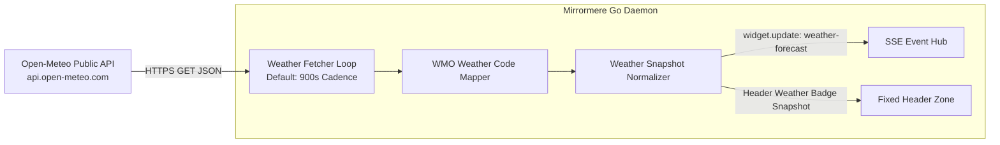
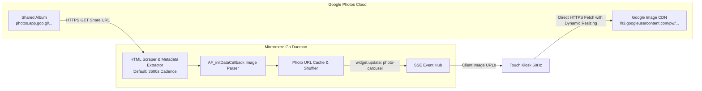

# SPEC-007: Core Ingestion Providers (iCal Feeds, Open-Meteo Weather, & Google Photos Shared Albums)

## Status
Approved / Core Ingestion Contract

## Context & Motivation
Mirrormere decouples physical display clients from data ingestion. To avoid third-party cloud credential friction (such as Google Cloud Console project registration, OAuth consent screens, and refresh token expiration) on Day 1, Mirrormere standardizes its foundational data ingestion on **three zero-credential, local-first protocols**:
1. **Multi-Calendar iCal (.ics) / CalDAV feeds**: Stateless polling of private calendar URLs.
2. **Open-Meteo Forecast Engine**: Public, keyless, rate-limit-free meteorological API.
3. **Google Photos Shared Album Ingestion**: Zero-auth extraction of high-resolution photo streams via public/unlisted album share links.

All three providers run as background worker loops within the Go daemon, normalizing external payloads into typed structs published via the Server-Sent Events (SSE) bus (`GET /api/events`).

---

## 1. Calendar Ingestion Provider (`providers/calendar`)



### Configuration Schema (`config.yaml`)

```yaml
providers:
  calendar:
    refresh_interval_seconds: 300 # 5 minutes
    window_days_past: 1
    window_days_future: 14
    sources:
      - name: "Family Calendar"
        url_env: FAMILY_CALENDAR_URL # Resolved from environment variable
        color: "#3b82f6" # Blue
        enabled: true
      - name: "Personal / Work"
        url_env: WORK_CALENDAR_URL # Resolved from environment variable
        color: "#10b981" # Green
        enabled: true
      - name: "US Holidays"
        url: "https://calendar.google.com/calendar/ical/en.usa%23holiday%40group.v.calendar.google.com/public/basic.ics"
        color: "#f59e0b" # Amber (public non-secret feeds may use url directly)
        enabled: true
```

### Normalized Internal Schema (`CalendarEvent`)

The parser evaluates RFC 5545 VEVENT components, expands recurrence rules (RRULE), and produces normalized JSON emitted on `widget.update`:

```json
{
  "widget_id": "calendar-agenda",
  "timestamp": "2026-09-24T22:20:00Z",
  "data": {
    "last_sync": "2026-09-24T22:20:00Z",
    "sync_status": "ok",
    "events": [
      {
        "id": "evt_20260924_1830_soccer",
        "calendar_name": "Family Calendar",
        "color": "#3b82f6",
        "title": "Soccer Practice",
        "start": "2026-09-24T18:30:00-07:00",
        "end": "2026-09-24T19:30:00-07:00",
        "all_day": false,
        "location": "Community Park Field 2",
        "description": "Bring shin guards and water bottle"
      },
      {
        "id": "evt_20260925_allday_pge",
        "calendar_name": "Personal / Work",
        "color": "#10b981",
        "title": "Trash & Recycling Pickup",
        "start": "2026-09-25",
        "end": "2026-09-25",
        "all_day": true,
        "location": "",
        "description": ""
      }
    ]
  }
}
```

### Advantages Over OAuth 2.0
- **Zero App Registration**: Requires no GCP project, verification audit, or client secret rotation.
- **Universal Interoperability**: Every major calendar system (Google, Apple, Microsoft Outlook 365, Fastmail, Nextcloud) exports a secret private iCal URL natively.
- **Hermetic & Airgapped Testing**: Tests can feed static `.ics` fixtures directly without mocking OAuth token refreshes.

### Zero-Secret Configuration Boundary (`url_env`)
Private iCal feeds (e.g. Google Calendar secret address `.ics` URLs, iCloud private share URLs, or CalDAV basic auth links) embed unauthenticated tokens or credentials directly within their URLs. Committing these URLs into version-controlled `config.yaml` files violates Mirrormere's Zero Plaintext Token invariant.

To enforce secret isolation:
- Private calendar sources MUST declare `url_env: <ENV_VAR_NAME>` rather than plaintext `url:`.
- At daemon startup, Mirrormere resolves the environment variable via `os.Getenv(source.URLEnv)`.
- If `url_env` is declared but the variable is unset or empty, configuration validation fails fast with an explicit diagnostic error before any network polling begins.
- Exactly one of `url` or `url_env` must be provided per calendar source. Plaintext `url:` is strictly reserved for public, non-secret feeds (e.g. national holidays or community schedules).

---

## 2. Weather Ingestion Provider (`providers/weather`)



### Configuration Schema (`config.yaml`)

```yaml
providers:
  weather:
    refresh_interval_seconds: 900 # 15 minutes
    latitude: 37.8044
    longitude: -122.2712
    timezone: "America/Los_Angeles" # "auto" or Olson TZ string
    units: "imperial" # "imperial" (F, mph, in) or "metric" (C, km/h, mm)
```

### Upstream Endpoint
Requests are routed directly to Open-Meteo's standard forecast endpoint:
```
https://api.open-meteo.com/v1/forecast?latitude=37.8044&longitude=-122.2712&current=temperature_2m,relative_humidity_2m,apparent_temperature,precipitation,weather_code,wind_speed_10m&hourly=temperature_2m,precipitation_probability,weather_code&daily=weather_code,temperature_2m_max,temperature_2m_min,precipitation_probability_max&temperature_unit=fahrenheit&wind_speed_unit=mph&precipitation_unit=inch&timezone=auto
```

### Normalized Internal Schema (`WeatherSnapshot`)

Weather codes conform to the World Meteorological Organization (WMO 4501) standard. The Go provider maps numeric codes to semantic strings and vector icon tokens:

```json
{
  "widget_id": "weather-forecast",
  "timestamp": "2026-09-24T22:20:00Z",
  "data": {
    "current": {
      "temperature": 68.4,
      "feels_like": 67.8,
      "humidity": 58,
      "wind_speed": 7.2,
      "units": {
        "temperature": "°F",
        "wind_speed": "mph"
      },
      "condition_code": 1,
      "condition_text": "Mainly Clear",
      "icon": "weather-partly-cloudy"
    },
    "hourly": [
      { "time": "2026-09-24T23:00:00-07:00", "temp": 66.2, "precip_prob": 0, "icon": "weather-partly-cloudy" },
      { "time": "2026-09-25T00:00:00-07:00", "temp": 64.0, "precip_prob": 5, "icon": "weather-cloudy" }
    ],
    "daily": [
      {
        "date": "2026-09-25",
        "temp_max": 72.5,
        "temp_min": 55.0,
        "precip_prob_max": 10,
        "condition_text": "Partly Cloudy",
        "icon": "weather-partly-cloudy"
      }
    ]
  }
}
```

### Dual-Use Target Routing
1. **Grid Widget (`widgets/weather-forecast`)**: Renders full 24-hour hourly timeline and 7-day extended forecasts on the 6×2 grid canvas (`[2, 1]` or `[3, 2]` blocks).
2. **Fixed Header Zone**: Automatically extracts `current.temperature` and `current.icon` into the persistent top banner across all screens without incurring extra API requests.

---

## 3. Google Photos Shared Album Provider (`providers/photos`)



### Context: The Share Link Architecture
Historically, Google Photos integrations required the Google Photos Library API with `photoslibrary.readonly` OAuth scopes. However, Google deprecated and severely restricted third-party access to this API in 2025. 

Fortunately, Google Photos provides **Unlisted Share Links** (e.g. `https://photos.app.goo.gl/...`). When an album is shared via link:
1. Anyone with the URL can view the album in a browser without signing into a Google account.
2. The initial page payload embeds structured metadata arrays containing the direct CDN image URLs (`https://lh3.googleusercontent.com/pw/...`).
3. Appending standard Google image sizing parameters (e.g. `=w1920-h1080-no` or `=w800-h480-c`) instructs Google's edge cache to serve the exact resolution and crop required by the display hardware.

### Configuration Schema (`config.yaml`)

```yaml
providers:
  photos:
    refresh_interval_seconds: 3600 # 1 hour
    albums:
      - name: "Family Live Album"
        share_url: "https://photos.app.goo.gl/AbCdEf123456789"
        shuffle: true
        preload_count: 50
        cycle_interval_seconds: 60 # Rotate image every 60s within widget
```

### Parsing Pipeline in Go
1. **HTTP Resolution**: The Go fetcher performs an HTTP GET on the `share_url` following redirects to `https://photos.google.com/share/...`.
2. **Data Extraction**: Extracts the JSON-like data blob within the `AF_initDataCallback` script tag or HTML meta tags containing photo entries:
   - Base image URL (`https://lh3.googleusercontent.com/...`)
   - Original upload timestamp
   - Intrinsic image width and height (aspect ratio)
3. **Parameter Injection**: Dynamic sizing parameters are applied based on the client hardware target:
   - **Touch Kiosk (1080p)**: `=w1920-h1080` (or `=w960-h960` for 50/50 split).
   - **E-Ink (800×480)**: `=w800-h480` for grayscale rendering.

### Normalized Internal Schema (`PhotoItem`)

Emitted via SSE on `widget.update`:

```json
{
  "widget_id": "photo-carousel",
  "timestamp": "2026-09-24T22:22:00Z",
  "data": {
    "album_name": "Family Live Album",
    "total_photos": 142,
    "cycle_interval_seconds": 60,
    "photos": [
      {
        "id": "photo_101",
        "url": "https://lh3.googleusercontent.com/pw/AP1Gcz...=w1920-h1080",
        "timestamp": "2026-08-15T14:30:00Z",
        "aspect_ratio": 1.33
      },
      {
        "id": "photo_102",
        "url": "https://lh3.googleusercontent.com/pw/AP1Gcz...=w1920-h1080",
        "timestamp": "2026-09-02T18:45:00Z",
        "aspect_ratio": 1.50
      }
    ]
  }
}
```

### Dual Display Adapter Handling
- **Touch Kiosk (Profile A)**: The PWA renders a smooth hardware-accelerated CSS crossfade slideshow occupying a 50/50 `[3, 2]` block or full-screen `[6, 2]` hero canvas, preloading the next image in background DOM.
- **Ambient E-Ink (Profile B)**: Photos carry the `.dither` class in `views/widget.html`. The headless renderer converts the photo bounding box to 8-bit grayscale and applies Floyd-Steinberg or Atkinson dithering to 1-bit monochrome (SPEC-003 §4), preserving sharp text thresholds for surrounding metadata, captions, and borders.
