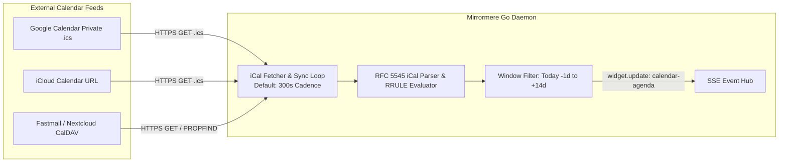
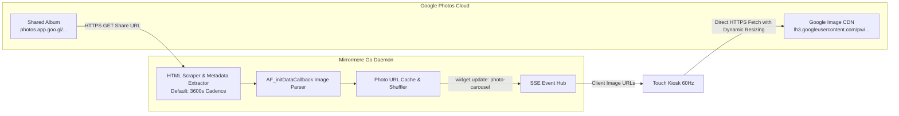

# SPEC-007: Core Ingestion Providers (iCal Feeds, Open-Meteo Weather, & Google Photos Shared Albums)

## Status
Approved / Core Ingestion Contract

## Context & Motivation
Mirrormere decouples physical display clients from data ingestion. To avoid third-party cloud credential friction (such as Google Cloud Console project registration, OAuth consent screens, and refresh token expiration) on Day 1, Mirrormere standardizes its foundational data ingestion on **three zero-credential, local-first protocols**:
1. **Multi-Calendar iCal (.ics) / CalDAV feeds**: Stateless polling of private calendar URLs.
2. **Open-Meteo Forecast Engine**: Public, keyless, rate-limit-free meteorological API.
3. **Google Photos Shared Album Ingestion**: Zero-auth extraction of high-resolution photo streams via public/unlisted album share links.

All three providers run as background worker loops within the Go daemon, normalizing external payloads into typed structs published via the Server-Sent Events (SSE) bus (`GET /api/events`).

---

## 1. Calendar Ingestion Provider (`providers/calendar`)



### Configuration Schema (`config.yaml`)

Each calendar widget instance configures its sync cadence, presentation window, and calendar feeds directly in `display.widgets[].config`:

```yaml
display:
  widgets:
    - id: family-calendar
      type: calendar-agenda
      dimensions: [4, 2]
      config:
        refresh_interval_seconds: 300 # 5 minutes
        window_days_past: 1
        window_days_future: 14
        view: week
        calendars:
          - name: "Family Calendar"
            url_env: FAMILY_CALENDAR_URL # Resolved from environment variable
            color: "#3b82f6" # Blue
            enabled: true
          - name: "Personal / Work"
            url_env: WORK_CALENDAR_URL # Resolved from environment variable
            color: "#10b981" # Green
            enabled: true
          - name: "US Holidays"
            url: "https://calendar.google.com/calendar/ical/en.usa%23holiday%40group.v.calendar.google.com/public/basic.ics"
            color: "#f59e0b" # Amber (public non-secret feeds may use url directly)
            enabled: true
```

### Normalized Internal Schema (`CalendarEvent`)

The parser evaluates RFC 5545 VEVENT components, expands recurrence rules (RRULE), and produces normalized JSON emitted on `widget.update`:

```json
{
  "widget_id": "family-calendar",
  "timestamp": "2026-09-24T22:20:00Z",
  "state": "healthy",
  "data": {
    "last_sync": "2026-09-24T22:20:00Z",
    "sync_status": "ok",
    "events": [
      {
        "id": "evt_20260924_1830_soccer",
        "calendar_name": "Family Calendar",
        "color": "#3b82f6",
        "title": "Soccer Practice",
        "start": "2026-09-24T18:30:00-07:00",
        "end": "2026-09-24T19:30:00-07:00",
        "all_day": false,
        "location": "Community Park Field 2",
        "description": "Bring shin guards and water bottle"
      },
      {
        "id": "evt_20260925_allday_pge",
        "calendar_name": "Personal / Work",
        "color": "#10b981",
        "title": "Trash & Recycling Pickup",
        "start": "2026-09-25",
        "end": "2026-09-25",
        "all_day": true,
        "location": "",
        "description": ""
      }
    ]
  }
}
```

### Advantages Over OAuth 2.0
- **Zero App Registration**: Requires no GCP project, verification audit, or client secret rotation.
- **Universal Interoperability**: Every major calendar system (Google, Apple, Microsoft Outlook 365, Fastmail, Nextcloud) exports a secret private iCal URL natively.
- **Hermetic & Airgapped Testing**: Tests can feed static `.ics` fixtures directly without mocking OAuth token refreshes.

### Zero-Secret Configuration Boundary (`url_env`)
Private iCal feeds (e.g. Google Calendar secret address `.ics` URLs, iCloud private share URLs, or CalDAV basic auth links) embed unauthenticated tokens or credentials directly within their URLs. Committing these URLs into version-controlled `config.yaml` files violates Mirrormere's Zero Plaintext Token invariant.

To enforce secret isolation:
- Private calendar sources MUST declare `url_env: <ENV_VAR_NAME>` rather than plaintext `url:`.
- At daemon startup, Mirrormere resolves the environment variable via `os.Getenv(source.URLEnv)`.
- If `url_env` is declared but the variable is unset or empty, configuration validation fails fast with an explicit diagnostic error before any network polling begins.
- Exactly one of `url` or `url_env` must be provided per calendar source. Plaintext `url:` is strictly reserved for public, non-secret feeds (e.g. national holidays or community schedules).

---

## 2. Weather Ingestion Provider (`providers/weather`)

```mermaid
flowchart LR
    OpenMeteo[Open-Meteo Public API\napi.open-meteo.com]

    subgraph GoDaemon [Mirrormere Go Daemon]
        HeaderPoller[Autonomous Header Poller\ndisplay.header.weather]
        WidgetPoller[Grid Widget Ingestion Loop\ndisplay.widgets[].config]
        WMO[WMO Weather Code Mapper]
        SSEHub[SSE Event Hub]

        HeaderPoller --> WMO
        WidgetPoller --> WMO
        WMO -->|header.update| SSEHub
        WMO -->|widget.update: <widget_id>| SSEHub
    end

    OpenMeteo -->|HTTPS GET JSON| HeaderPoller
    OpenMeteo -->|HTTPS GET JSON| WidgetPoller
```

### Configuration Schema (`config.yaml`)

Each weather widget instance specifies its own coordinates, units, and refresh interval directly in its `config:` mapping:

```yaml
display:
  widgets:
    - id: home-weather
      type: weather-forecast
      dimensions: [2, 1]
      config:
        refresh_interval_seconds: 900 # 15 minutes
        latitude: 37.8044
        longitude: -122.2712
        units: "imperial" # "imperial" (F, mph, in) or "metric" (C, km/h, mm)

    - id: office-weather            # Second independent location on another screen!
      type: weather-forecast
      dimensions: [2, 1]
      config:
        refresh_interval_seconds: 900
        latitude: 37.7749
        longitude: -122.4194
        units: "imperial"
```

### Upstream Endpoint
Requests are routed directly to Open-Meteo's standard forecast endpoint:
```
https://api.open-meteo.com/v1/forecast?latitude=37.8044&longitude=-122.2712&current=temperature_2m,relative_humidity_2m,apparent_temperature,precipitation,weather_code,wind_speed_10m&hourly=temperature_2m,precipitation_probability,weather_code&daily=weather_code,temperature_2m_max,temperature_2m_min,precipitation_probability_max&temperature_unit=fahrenheit&wind_speed_unit=mph&precipitation_unit=inch&timezone=auto
```

### Normalized Internal Schema (`WeatherSnapshot`)

Weather codes conform to the World Meteorological Organization (WMO 4501) standard. The Go provider maps numeric codes to semantic strings and vector icon tokens:

```json
{
  "widget_id": "local-weather",
  "timestamp": "2026-09-24T22:20:00Z",
  "state": "healthy",
  "data": {
    "current": {
      "temperature": 68.4,
      "feels_like": 67.8,
      "humidity": 58,
      "wind_speed": 7.2,
      "units": {
        "temperature": "°F",
        "wind_speed": "mph"
      },
      "condition_code": 1,
      "condition_text": "Mainly Clear",
      "icon": "weather-partly-cloudy"
    },
    "hourly": [
      { "time": "2026-09-24T23:00:00-07:00", "temp": 66.2, "precip_prob": 0, "icon": "weather-partly-cloudy" },
      { "time": "2026-09-25T00:00:00-07:00", "temp": 64.0, "precip_prob": 5, "icon": "weather-cloudy" }
    ],
    "daily": [
      {
        "date": "2026-09-25",
        "temp_max": 72.5,
        "temp_min": 55.0,
        "precip_prob_max": 10,
        "condition_text": "Partly Cloudy",
        "icon": "weather-partly-cloudy"
      }
    ]
  }
}
```

### Target Routing
1. **Grid Widget (`widgets/weather-forecast`)**: Renders full 24-hour hourly timeline and 7-day extended forecasts on the 6×2 grid canvas (`[2, 1]` or `[3, 2]` blocks).
*(Note: Top-banner header weather is managed independently via `display.header.weather` and `header.update` SSE events per Section 4 below).*

---

## 3. Google Photos Shared Album Provider (`providers/photos`)



### Context: The Share Link Architecture
Historically, Google Photos integrations required the Google Photos Library API with `photoslibrary.readonly` OAuth scopes. However, Google deprecated and severely restricted third-party access to this API in 2025. 

Fortunately, Google Photos provides **Unlisted Share Links** (e.g. `https://photos.app.goo.gl/...`). When an album is shared via link:
1. Anyone with the URL can view the album in a browser without signing into a Google account.
2. The initial page payload embeds structured metadata arrays containing the direct CDN image URLs (`https://lh3.googleusercontent.com/pw/...`).
3. Appending standard Google image sizing parameters (e.g. `=w{width}-h{height}-c`) instructs Google's edge cache to serve the exact resolution and crop required by the client.

### Configuration Schema (`config.yaml`)

```yaml
display:
  widgets:
    - id: living-room-photos
      type: photo-carousel
      dimensions: [3, 2]
      config:
        share_url: "https://photos.app.goo.gl/AbCdEf123456789"
        refresh_interval_seconds: 3600 # 1 hour album metadata sync
        cycle_interval_seconds: 60     # Rotate image every 60s within widget
        preload_count: 50
        shuffle: true
```

### Parsing Pipeline in Go
1. **HTTP Resolution**: The Go fetcher performs an HTTP GET on the `share_url` following redirects to `https://photos.google.com/share/...`.
2. **Data Extraction**: Extracts the JSON-like data blob within the `AF_initDataCallback` script tag or HTML meta tags containing photo entries:
   - Base image URL (`https://lh3.googleusercontent.com/...`)
   - Original upload timestamp
   - Intrinsic image width and height (aspect ratio)
3. **Clean Base URL Emission**: Core emits the unadorned CDN base image URL in `PhotoItem.url` (along with `aspect_ratio`). Core avoids baking static resolution parameters or hardware-specific targets into stored photo payloads.

### Dynamic Presentation Sizing (Zero Hardware Targets)

Rather than hard-coding hardware resolutions in `config.yaml` or maintaining device profile lookup tables in Go, photo sizing is computed **dynamically at presentation time based on the rendered geometry of the photo widget on the grid canvas**:

1. **DOM Container Measurement**:
   When the photo widget (`widgets/photo-carousel/views/widget.html`) mounts in the client (either interactive Touch Kiosk Chromium or E-Ink headless Chromium sidecar), the client presentation script measures the rendered container element's bounding box:
   ```javascript
   const rect = container.getBoundingClientRect();
   const dpr = window.devicePixelRatio || 1;
   const targetWidth = Math.round(rect.width * dpr);
   const targetHeight = Math.round(rect.height * dpr);
   ```
2. **Dynamic CDN Parameter Injection**:
   The client appends Google's edge-resizing query parameters to the clean base URL:
   ```javascript
   const sizedUrl = `${photo.url}=w${targetWidth}-h${targetHeight}-c`;
   ```
3. **Adaptive Across Screen Densities & Grid Dimensions**:
   - **Grid Geometry Adaptivity**: A `dimensions: [3, 2]` widget (half-width on 6×2 grid) dynamically requests ~960×960px on a 1080p kiosk. If the operator reconfigures the widget to a full-screen hero `dimensions: [6, 2]`, it automatically requests ~1920×980px with zero configuration changes.
   - **Display Target Adaptivity**: On Mike's 800×480 E-Ink panel, the headless Chromium capture sidecar measures the widget container as ~400×420px (for `[3, 2]`), automatically pulling low-bandwidth, downscaled images from Google's edge before dithering.
   - **Optional Override**: Operators may optionally specify `image_size: [width, height]` under widget `config:` if they wish to pin or cap the maximum CDN fetch resolution explicitly.

### Normalized Internal Schema (`PhotoItem`)

Emitted via SSE on `widget.update`:

```json
{
  "widget_id": "living-room-photos",
  "timestamp": "2026-09-24T22:22:00Z",
  "state": "healthy",
  "data": {
    "album_name": "Family Live Album",
    "total_photos": 142,
    "cycle_interval_seconds": 60,
    "photos": [
      {
        "id": "photo_101",
        "url": "https://lh3.googleusercontent.com/pw/AP1Gcz...",
        "timestamp": "2026-08-15T14:30:00Z",
        "aspect_ratio": 1.33
      },
      {
        "id": "photo_102",
        "url": "https://lh3.googleusercontent.com/pw/AP1Gcz...",
        "timestamp": "2026-09-02T18:45:00Z",
        "aspect_ratio": 1.50
      }
    ]
  }
}
```

### Dual Display Adapter Handling
- **Touch Kiosk (Profile A)**: The PWA renders a smooth hardware-accelerated CSS crossfade slideshow occupying a 50/50 `[3, 2]` block or full-screen `[6, 2]` hero canvas, preloading the next image in background DOM.
- **Ambient E-Ink (Profile B)**: Photos carry the `.dither` class in `views/widget.html`. The headless renderer converts the photo bounding box to 8-bit grayscale and applies Floyd-Steinberg or Atkinson dithering to 1-bit monochrome (SPEC-003 §5), preserving sharp text thresholds for surrounding metadata, captions, and borders.

---

## 4. Autonomous Header Weather & Multi-Instance SSE Routing

Data ingestion for the persistent 60px Fixed Header operates completely separate from `display.widgets`. A deployment may display ambient weather in the header without configuring any weather widgets on the 6×2 grid.

### Autonomous Fixed Header Weather Configuration
When `weather_badge` is enabled in `display.header.elements`, its weather parameters are configured directly under `display.header.weather`:

```yaml
display:
  header:
    enabled: true
    elements:
      - clock
      - date
      - weather_badge
      - sync_status
    weather:                        # Fully autonomous header weather configuration
      refresh_interval_seconds: 900 # 15 minutes
      latitude: 37.8044
      longitude: -122.2712
      units: imperial               # "imperial" | "metric"
```

The Go daemon manages a lightweight poller dedicated to hydrating the header's temperature and condition badge across all screens. It does not require any `weather-forecast` widget to be defined in `display.widgets`.

### Independent Grid Widget Ingestion
If a deployment also includes one or more `weather-forecast` widgets on the 6×2 grid (e.g. for hourly timeline cards or secondary locations like `office-weather`), each widget manages its own independent poller and configuration under `display.widgets[].config`.

### Multi-Instance SSE Event Routing
When any widget instance completes an ingestion cycle (e.g. `home-weather` vs `office-weather`), it emits a `widget.update` event over the Server-Sent Events bus tagged with its unique `widget_id`:

```json
{
  "widget_id": "home-weather",
  "timestamp": "2026-09-24T22:20:00Z",
  "state": "healthy",
  "data": { ... }
}
```

Display clients match incoming SSE events to their respective DOM containers via `data-widget-id="home-weather"`, ensuring independent updating across multiple instances without cross-talk or redundant fetches.

### Header Weather Delivery (`header.update`)
When the autonomous header weather poller completes an ingestion cycle, Core broadcasts a dedicated `header.update` SSE event (SPEC-006 §2) containing the current ambient conditions:

```json
{
  "timestamp": "2026-09-24T22:20:00Z",
  "weather": {
    "temperature": 72.4,
    "units": "F",
    "weather_code": 1,
    "icon": "weather-sunny"
  }
}
```

All connected display clients (touch kiosks and ambient e-paper nodes) update their persistent top banner directly from `header.update` without requiring an on-grid weather widget or custom client-side parsing.

