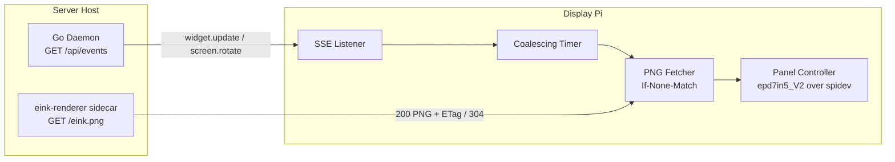

# SPEC-009: E-Ink Display Node Client (`clients/eink-node`)

## Status
Proposed

## Context & Motivation
SPEC-003 §3 moves all e-ink rasterization into the `mirrormere-eink-renderer`
sidecar, which serves an 800×480 1-bit PNG at `GET /eink.png`. Something still
has to run on the physical display Pi, take that image, and put it on the
panel without wasting refreshes or losing the screen when the network drops.

This spec defines that client. It is deliberately thin: it draws no widgets,
parses no widget data, and holds no credentials. Its only jobs are **when** to
refresh, **how** to refresh, and **what to show when things are down**.

### Decisions (settled in #mirrormere, 2026-09-24)
| Question | Decision |
|---|---|
| Language & driver | Python daemon on Waveshare's `waveshare-epd` driver (`epd7in5_V2`) over `spidev` |
| Trigger transport | SSE listener on `GET /api/events` with local coalescing (no polling loop) |
| Refresh lifecycle | Partial refreshes for updates; a full refresh every 60 minutes |
| Offline behavior | Keep the last image on the panel; overlay an 8×8 disconnect dot |

---

## Reference Hardware (Mike's unit)
- **Compute**: Raspberry Pi 3 Model B+ (Pi 4B also supported). Raspberry Pi OS Lite, 64-bit.
- **Panel**: Waveshare 7.5" V2 raw e-paper panel, 800×480, black/white.
- **Driver board**: Adafruit E-Ink Bonnet (24-pin FPC), **not** the Waveshare HAT.
- **Power**: 5V 2.5A micro-USB supply (Pi 3 B+) or USB-C (Pi 4B).

### Pin Map
`waveshare-epd` hardcodes Waveshare HAT pins in `epdconfig.py`. The Bonnet
wires the control lines differently, so the client **must** take its pin map
from config and patch the driver's module constants before `init()`:

| Signal | Waveshare HAT (driver default) | Adafruit E-Ink Bonnet |
|---|---|---|
| RST | GPIO 17 | GPIO 27 |
| DC | GPIO 25 | GPIO 22 |
| BUSY | GPIO 24 | GPIO 17 |
| CS | CE0 (GPIO 8) | CE0 (GPIO 8) |
| PWR | GPIO 18 | none (leave unset) |

The Bonnet's two buttons (GPIO 5, GPIO 6) are optional inputs, see
"Buttons" below.

---

## Architecture



Single process, three cooperating threads (SSE reader, refresh worker, full-
refresh timer), one lock around the panel. Only the refresh worker touches SPI.

---

## Trigger Model

1. The client holds `GET /api/events` (SPEC-006) open.
2. Any `widget.update` or `screen.rotate` event marks the screen **dirty**.
   `system.status` and `: ping` lines do not.
3. The refresh worker waits until the screen has been dirty for
   `coalesce_seconds` (default 5) **and** at least `min_refresh_seconds`
   (default 60) have passed since the last panel write. A burst of kiosk taps
   produces one refresh.
4. The worker fetches `GET /eink.png` with `If-None-Match: <last etag>`.
   - `304` or identical bytes: no panel write. Dirty flag clears.
   - `200` with new bytes: partial refresh (below).
5. A safety fetch runs every `max_idle_seconds` (default 900) even with no
   events, so a missed event cannot leave the panel stale indefinitely.

### Requirement on the sidecar (amends SPEC-003 §3 & §4)
To avoid a race where the client fetches before the sidecar re-renders,
`GET /eink.png` must render **on request** (or return a render newer than the
last `widget.update`), and must send a strong `ETag` equal to a hash of the
PNG bytes.

Additionally, the sidecar is responsible for applying the **selective dithering pipeline** (SPEC-003 §4). By strictly thresholding text/UI lines and restricting error-diffusion dithering to `.dither` regions (photos/weather icons), the sidecar ensures the display node receives clean 1-bit monochrome data. The client node validates that incoming PNG payloads are 1-bit (`mode == "1"`) and passes pixels directly to the hardware frame buffer without performing client-side re-dithering.

---

## Refresh Lifecycle

| Refresh | When | Driver call |
|---|---|---|
| Full | Boot; every `full_refresh_minutes` (default 60); after reconnect; after 30 consecutive partials | `init()` + `display()` |
| Partial | Every other content change | `init_part()` + `display_Partial()` |
| Clear | Only on `SIGTERM` when `clear_on_shutdown: true` (default false) | `Clear()` + `sleep()` |

- The panel is put into deep sleep (`sleep()`) after every write. The
  controller wakes it on the next write.
- Image input is validated before any SPI write: must decode as PNG, size
  exactly 800×480, mode `1` (or convertible without dithering). A malformed
  image is logged and dropped; the panel keeps the last good image.

---

## Offline Behavior

- The panel is bistable, so the last image stays visible with no power spent.
- When the SSE stream drops or a fetch fails for longer than
  `offline_grace_seconds` (default 120), the client draws an **8×8 black dot
  in the top-right corner** with one partial refresh, over the last good
  image held in memory.
- SSE reconnect uses exponential backoff (1 s doubling to 60 s max) and sends
  `Last-Event-ID`.
- On reconnect: fetch immediately, then do a **full** refresh, which also
  removes the dot.
- The last good PNG is also written to `/var/lib/mirrormere-eink/last.png` so
  a reboot while offline restores the screen plus dot, not a blank panel.

---

## Buttons (optional, Bonnet only)
| Button | GPIO | Action |
|---|---|---|
| 1 | 5 | Force fetch and **full** refresh now |
| 2 | 6 | `POST /api/screen/select` to advance to the next screen (SPEC-005/006) |

Disabled unless `buttons.enabled: true`.

---

## Configuration (`/etc/mirrormere-eink/config.yaml`)

```yaml
server:
  events_url: "http://192.168.1.77:8080/api/events"
  image_url: "http://192.168.1.77:8081/eink.png"
  shared_secret_env: MIRRORMERE_SECRET   # optional, SPEC-008 auth

panel:
  driver: epd7in5_V2
  pins:            # Adafruit E-Ink Bonnet
    rst: 27
    dc: 22
    busy: 17
    cs: 8
    pwr: null

refresh:
  coalesce_seconds: 5
  min_refresh_seconds: 60
  max_idle_seconds: 900
  full_refresh_minutes: 60
  max_consecutive_partials: 30
  offline_grace_seconds: 120
  clear_on_shutdown: false

buttons:
  enabled: false
  refresh_pin: 5
  next_screen_pin: 6
```

---

## Packaging & Deployment
- Lives at `clients/eink-node/` in this repo: a Python package plus a
  `systemd` unit (`mirrormere-eink.service`, `Restart=always`, runs as a
  dedicated `mirrormere` user in the `spi` and `gpio` groups).
- Installed on bare Raspberry Pi OS Lite with `pip` into a venv, **not** Docker:
  the node needs direct `/dev/spidev0.0` and GPIO access, and a container adds
  nothing on a single-purpose Pi.
- Dependencies: `waveshare-epd` (vendored or pinned to a commit, since it is
  not reliably published to PyPI), `spidev`, `gpiozero`, `Pillow`,
  `requests`, `PyYAML`.
- Prerequisite: `dtparam=spi=on` in `/boot/firmware/config.txt`.

## Observability
- Logs to the journal: every panel write with refresh type, trigger, ETag and
  write duration; every connect/disconnect.
- `GET :9100/healthz` on the node (optional) returns last write time, last
  ETag, connection state, and partials since last full refresh.

## Testing
- The panel controller sits behind an interface with a **fake panel** that
  writes each frame to disk, so the trigger, coalescing, offline and
  full/partial logic are unit-tested without hardware.
- Hardware smoke test: `python -m mirrormere_eink.selftest` draws a test card
  with a full refresh, then a partial update of one region.
