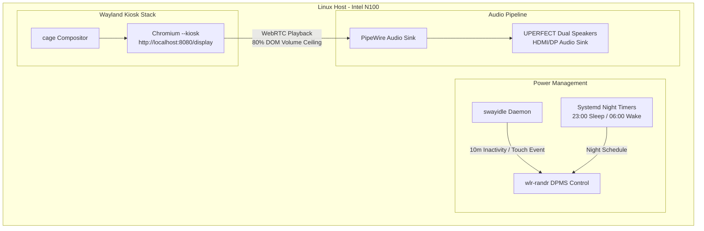

# SPEC-010: Touch Kiosk Client Environment (`deploy/kiosk`)

## Status
Approved

## Context & Motivation
SPEC-002 defines the hardware architecture for the Touch Kiosk (Profile A): an Intel N100 Mini PC paired with a 15.6" 1080p capacitive touchscreen monitor in a VESA sandwich mount. SPEC-009 defines the ambient e-ink display node client (`clients/eink-node`). 

This specification defines the dedicated client runtime environment and OS bootstrap for the Touch Kiosk (`deploy/kiosk`), formalizing how Wayland kiosk confinement, hardware-accelerated Chromium rendering, DPMS power management, HDMI audio routing, and systemd services operate together on Debian/Ubuntu Linux.

### Decisions (settled in #mirrormere, 2026-09-24)
- **Kiosk Compositor**: Wayland with `cage` (single-application fullscreen confinement, hardware-accelerated via Intel Mesa/Iris EGL).
- **Browser Runtime**: Native Chromium in `--kiosk` mode pointing to `http://localhost:8080/display`.
- **Zero On-Screen Keyboard (OSK)**: Tap-and-gesture interaction only (screen rotation swipes, video HUD transport controls). No virtual keyboard daemon or touch keyboard overlays; task lists are strictly read-only ambient surfaces, and all task additions/edits are handled phone-first at the source.
- **Power Management**: Dual sleep lifecycle—a fixed night schedule (hard off 11 PM – 6 AM) paired with daytime idle DPMS blanking (10-minute timeout) with instant wake-on-tap via capacitive touchscreen input events.
- **Audio Routing**: Video and alert audio are delivered directly via standard WebRTC playback in Chromium to the UPERFECT monitor's built-in dual stereo speakers over HDMI/USB-C via PipeWire. Host-level loopback (`pw-loopback`) is eliminated so that browser volume/mute controls, PiP ducking, and touch HUD controls remain unified.
- **Voice Ingest**: Nano USB microphone hardware present on the compute unit, but software voice processing (`mirrormere-voice` client and LAN Voice Hub in SPEC-011) is deferred to post-v1.

---

## Architecture & Process Model



---

## Compositor & Chromium Kiosk Flags

The kiosk session is launched as a dedicated systemd service under an unprivileged `kiosk` user.

### Launch Command
```bash
exec cage -s -- chromium \
  --kiosk \
  --noerrdialogs \
  --disable-infobars \
  --disable-session-crashed-bubble \
  --disable-translate \
  --check-for-update-interval=31536000 \
  --enable-features=OverlayScrollbar \
  --use-gl=egl \
  --ozone-platform=wayland \
  --enable-wayland-ime \
  --autoplay-policy=no-user-gesture-required \
  http://localhost:8080/display
```

### Flag Rationale
- `--kiosk`: Enforces true fullscreen execution with navigation controls and URL bar stripped.
- `--ozone-platform=wayland` and `--use-gl=egl`: Native Wayland buffer presentation with hardware acceleration on Intel N100 Gen12 graphics.
- `--autoplay-policy=no-user-gesture-required`: Permits instant WebRTC video and alert audio playback without requiring manual user touch interactions.

---

## Power Management & Sleep Lifecycle

The monitor backlight consumes power and emits light that must be suppressed at night and when the room is empty.

### 1. Daytime Inactivity Sleep (DPMS)
- Managed by `swayidle` running in the `kiosk` session:
  ```bash
  swayidle -w \
    timeout 600 'wlr-randr --output HDMI-A-1 --off' \
    resume 'wlr-randr --output HDMI-A-1 --on'
  ```
- **Wake on Tap**: Capacitive touchscreen touches register as Linux `evdev` touch events through `libinput`. Wayland seat activity triggers `swayidle` resume, instantly powering the display back on without requiring physical power buttons.

### 2. Fixed Night Schedule
- Systemd timers enforce hard blackout during night hours:
  - `mirrormere-kiosk-sleep.timer`: Runs at `23:00` daily, issuing `wlr-randr --output HDMI-A-1 --off`.
  - `mirrormere-kiosk-wake.timer`: Runs at `06:00` daily, issuing `wlr-randr --output HDMI-A-1 --on`.
- Tapping the display during the night window temporarily wakes the screen for the daytime idle duration (10 minutes) before returning to sleep.

---

## Audio Pipeline

The UPERFECT 15.6" monitor contains dual integrated chassis speakers. Audio is delivered digitally over the HDMI / USB-C connection from the Intel N100 via PipeWire.

### WebRTC Audio Playback & Pure Software Volume Attenuation
Rather than running an external ALSA host loopback daemon (which bypasses browser volume and mutes) or modifying host-level ALSA/PipeWire volume settings (e.g. `wpctl`), all video and doorbell alert audio streams are delivered as WebRTC media streams directly to Chromium's HTML5 `<video>` player (SPEC-004):
- **Unified Controls**: Chromium handles digital volume attenuation, muting, and PiP audio ducking natively in the DOM without split-brain host routing or host OS privileges.
- **Pure Software Volume Ceiling**: To prevent speaker distortion or blown drivers without depending on host OS commands, Chromium enforces an 80% maximum volume ceiling directly in software on the media element:
  ```javascript
  const effectiveVolume = (masterVolume / 100) * 0.80 * (isDucked ? 0.20 : 1.0) * (isMuted ? 0.0 : 1.0);
  videoElement.volume = effectiveVolume;
  ```

---

## Packaging & Systemd Bootstrap

The host kiosk provisioning setup is maintained in `deploy/kiosk/` with an automated install script (`install.sh`) targeting Debian 12 / Ubuntu 24.04 Server.

### System Prerequisites
- Packages: `cage`, `chromium`, `swayidle`, `wlr-randr`, `pipewire`, `wireplumber`, `pipewire-alsa`, `libinput-bin`.
- User permissions: `kiosk` user added to groups `video`, `input`, `audio`, `render`.
- TTY auto-login: Configured via `/etc/systemd/system/getty@tty1.service.d/override.conf` to automatically launch the `kiosk` user session on boot.

### Service Units
- `mirrormere-kiosk.service`: Manages the `cage` + `chromium` process tree with `Restart=always`.
- `mirrormere-kiosk-sleep.{service,timer}`: Night schedule blanking.
- `mirrormere-kiosk-wake.{service,timer}`: Morning schedule waking.

---

## Touch Interaction & UI Polish

The Touch Kiosk PWA implements strict touch and animation hygiene to deliver a responsive, appliance-grade feel:

1. **Browser Touch Sanitization**:
   - **Tap Highlight Suppression**: `-webkit-tap-highlight-color: transparent` eliminates default blue/gray flash artifacts on capacitive taps.
   - **Text Selection Suppression**: `user-select: none; -webkit-user-select: none; -webkit-touch-callout: none` prevents accidental text highlighting, magnifiers, or context menus during rapid screen taps.
   - **Minimum Touch Targets**: All interactive targets (navigation controls, HUD transport buttons) must meet or exceed a 48×48px tap hit area.

2. **Slider Drag Commit Semantics**:
   - When manipulating touch sliders (e.g. video HUD volume controls or future device dimmers), the UI updates visually in real-time (60fps local tracking) but defers network mutation calls (`POST /api/audio/volume`) until the gesture commits on touch release (`pointerup` / `touchend`), or throttles network dispatch to at most once per 200ms during continuous drags, preventing REST dispatch storms.

3. **Motion & Transitions**:
   - Screen rotation transitions (slide/fade per SPEC-005) are hardware-accelerated (`transform: translate3d(...)` / `opacity`) and capped at `300ms` duration with `cubic-bezier(0.25, 1, 0.5, 1)` easing.
