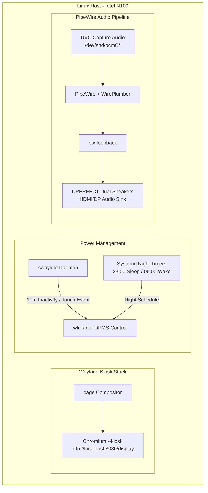

# SPEC-010: Touch Kiosk Client Environment (`clients/touch-kiosk`)

## Status
Approved

## Context & Motivation
SPEC-002 defines the hardware architecture for the Touch Kiosk (Profile A): an Intel N100 Mini PC paired with a 15.6" 1080p capacitive touchscreen monitor in a VESA sandwich mount. SPEC-009 defines the ambient e-ink display node client (`clients/eink-node`). 

This specification defines the dedicated client runtime environment and OS bootstrap for the Touch Kiosk (`clients/touch-kiosk`), formalizing how Wayland kiosk confinement, hardware-accelerated Chromium rendering, DPMS power management, HDMI audio routing, and systemd services operate together on Debian/Ubuntu Linux.

### Decisions (settled in #mirrormere, 2026-09-24)
- **Kiosk Compositor**: Wayland with `cage` (single-application fullscreen confinement, hardware-accelerated via Intel Mesa/Iris EGL).
- **Browser Runtime**: Native Chromium in `--kiosk` mode pointing to `http://localhost:8080/display`.
- **Zero On-Screen Keyboard (OSK)**: Tap-and-gesture interaction only (checkbox toggles, screen rotation swipes, video PiP controls). No virtual keyboard daemon or touch keyboard overlays; new task/list additions are handled phone-first.
- **Power Management**: Dual sleep lifecycle—a fixed night schedule (hard off 11 PM – 6 AM) paired with daytime idle DPMS blanking (10-minute timeout) with instant wake-on-tap via capacitive touchscreen input events.
- **Audio Routing**: UVC HDMI capture audio routed straight to the UPERFECT monitor's built-in dual stereo speakers over HDMI/USB-C via PipeWire loopback (`pw-loopback`).
- **Voice Ingest**: Nano USB microphone hardware present on the compute unit, but software voice processing (`wyoming-satellite`) is deferred to post-v1.

---

## Architecture & Process Model



---

## Compositor & Chromium Kiosk Flags

The kiosk session is launched as a dedicated systemd service under an unprivileged `kiosk` user.

### Launch Command
```bash
exec cage -s -- chromium \
  --kiosk \
  --noerrdialogs \
  --disable-infobars \
  --disable-session-crashed-bubble \
  --disable-translate \
  --check-for-update-interval=31536000 \
  --enable-features=OverlayScrollbar \
  --use-gl=egl \
  --ozone-platform=wayland \
  --enable-wayland-ime \
  --autoplay-policy=no-user-gesture-required \
  --use-fake-ui-for-media-stream \
  http://localhost:8080/display
```

### Flag Rationale
- `--kiosk`: Enforces true fullscreen execution with navigation controls and URL bar stripped.
- `--ozone-platform=wayland` and `--use-gl=egl`: Native Wayland buffer presentation with hardware acceleration on Intel N100 Gen12 graphics.
- `--autoplay-policy=no-user-gesture-required`: Permits video streaming from the UVC capture card (SPEC-004) without requiring manual touch interaction to start playback.
- `--use-fake-ui-for-media-stream`: Automatically grants `getUserMedia` camera/audio permissions for the UVC capture device (`/dev/video0`), eliminating permission popups.

---

## Power Management & Sleep Lifecycle

The monitor backlight consumes power and emits light that must be suppressed at night and when the room is empty.

### 1. Daytime Inactivity Sleep (DPMS)
- Managed by `swayidle` running in the `kiosk` session:
  ```bash
  swayidle -w \
    timeout 600 'wlr-randr --output HDMI-A-1 --off' \
    resume 'wlr-randr --output HDMI-A-1 --on'
  ```
- **Wake on Tap**: Capacitive touchscreen touches register as Linux `evdev` touch events through `libinput`. Wayland seat activity triggers `swayidle` resume, instantly powering the display back on without requiring physical power buttons.

### 2. Fixed Night Schedule
- Systemd timers enforce hard blackout during night hours:
  - `mirrormere-kiosk-sleep.timer`: Runs at `23:00` daily, issuing `wlr-randr --output HDMI-A-1 --off`.
  - `mirrormere-kiosk-wake.timer`: Runs at `06:00` daily, issuing `wlr-randr --output HDMI-A-1 --on`.
- Tapping the display during the night window temporarily wakes the screen for the daytime idle duration (10 minutes) before returning to sleep.

---

## Audio Pipeline

The UPERFECT 15.6" monitor contains dual integrated chassis speakers. Audio is delivered digitally over the HDMI / USB-C connection from the Intel N100.

### Chromecast UVC Loopback
When video is cast to the Chromecast dongle, the MS2109 USB capture card exposes both a video capture node (`/dev/video0`) and an ALSA audio capture node (`hw:CARD=MS2109,DEV=0`).

PipeWire routes audio from the capture card to the display speakers using a persistent loopback service (`mirrormere-audio-loopback.service`):
```bash
pw-loopback \
  --capture-props='media.class=Audio/Sink node.name=uvc_capture' \
  --playback-props='node.target=alsa_output.pci-0000_00_1f.3.hdmi-stereo'
```
This guarantees zero latency mismatch between the HTML5 video player (SPEC-004) and monitor audio output.

---

## Packaging & Systemd Bootstrap

The client setup is maintained in `clients/touch-kiosk/` with an automated install script (`install.sh`) targeting Debian 12 / Ubuntu 24.04 Server.

### System Prerequisites
- Packages: `cage`, `chromium`, `swayidle`, `wlr-randr`, `pipewire`, `wireplumber`, `pipewire-alsa`, `libinput-bin`.
- User permissions: `kiosk` user added to groups `video`, `input`, `audio`, `render`.
- TTY auto-login: Configured via `/etc/systemd/system/getty@tty1.service.d/override.conf` to automatically launch the `kiosk` user session on boot.

### Service Units
- `mirrormere-kiosk.service`: Manages the `cage` + `chromium` process tree with `Restart=always`.
- `mirrormere-audio-loopback.service`: Manages `pw-loopback` for UVC capture audio.
- `mirrormere-kiosk-sleep.{service,timer}`: Night schedule blanking.
- `mirrormere-kiosk-wake.{service,timer}`: Morning schedule waking.
