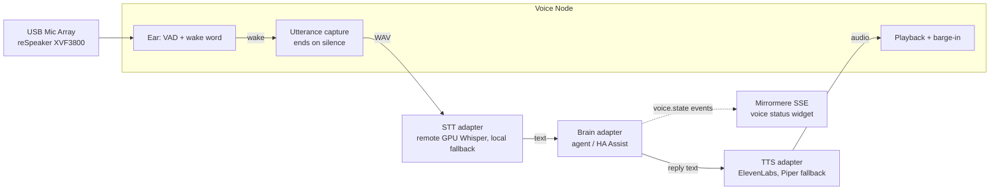

# SPEC-011: Voice Pipeline (Wake Word, STT, Agent, TTS with Local Fallback)

## Status
Proposed. Reference implementation exists (Mike's household); Mirrormere
integration not yet built.

## Context & Motivation
SPEC-003 names an `audio-reactive` capability and stops there. Both
households want a room voice node on their display, but with different
brains behind it: Alex routes voice through Home Assistant (Wyoming / Assist),
Mike through his own agent stack. The mic, wake word, speech-to-text and
text-to-speech stages are the same problem in both houses; only the "think"
stage differs.

This spec defines voice as an **optional module** with swappable stages, and
documents Mike's working pipeline as the reference implementation, including
its ElevenLabs-first TTS with automatic local Piper fallback.

The core stays voice-free. A household without a mic runs Mirrormere unchanged.

---

## Pipeline



Every stage is an adapter behind a small interface. Every stage has a
degraded mode, so the node never goes silent because one service is down.

---

## Stage Contracts

### 1. Ear (wake word + capture)
- Input: 16 kHz mono PCM from the default audio source.
- **VAD gate** (webrtcvad, 30 ms frames) so wake-word detection runs only on
  speech, not on silence.
- **Wake word detection is local and never leaves the device.** Audio is sent
  anywhere only after a wake.
- Capture ends after `silence_ms` (default 800) of non-speech.
- **Follow-up window**: for `followup_seconds` (default 8) after a reply, the
  next utterance needs no wake word.
- Emits `idle | listening | thinking | speaking` state transitions.

Reference implementation: a fixed wake phrase ("hey amos") spotted by running
whisper `tiny.en` over the last few seconds of VAD-gated audio, with the
decoder biased by `initial_prompt` and a stop-list of near-miss words whisper
produces at room distance ("almost", "amazon", "atmos"). openWakeWord is the
lighter alternative for a Pi-class node and should be the default in
Mirrormere.

### 2. STT adapter
```python
class STT(Protocol):
    def transcribe(self, wav: bytes) -> str: ...
```
| Adapter | Where | Notes |
|---|---|---|
| `whisper_http` | GPU box on the LAN | faster-whisper `large-v3` on CUDA behind `POST /transcribe` (WAV in, JSON text out) and `GET /health`. ~1 s per utterance. Model stays loaded, so no per-clip load cost. |
| `whisper_local` | On the node | faster-whisper `small` int8. The fallback when the GPU box's `/health` fails. Slower, but always there. |
| `wyoming` | Home Assistant | For households whose STT already lives in HA. |

Selection is by reachability: try the configured primary when its health
check is green, otherwise go local. The choice is made per utterance, never
latched.

### 3. Brain adapter
```python
class Brain(Protocol):
    def ask(self, text: str, context: dict) -> Iterator[str]: ...  # reply text, may stream
```
| Adapter | Household | Notes |
|---|---|---|
| `ha_assist` | Alex | Home Assistant Assist pipeline over its API or Wyoming. |
| `http_agent` | Mike | POST the transcript to an agent endpoint; the reply text comes back. Mike's stack also posts the transcript and reply to a text channel as a record. |

The brain is where household-specific logic lives, and it lives in the
private extensions directory (SPEC-003). Mirrormere ships only the interface
and the `ha_assist` adapter.

### 4. TTS adapter: ElevenLabs primary, Piper fallback
```python
class TTS(Protocol):
    def speak(self, text: str, voice: str) -> bytes: ...   # audio (mp3/wav)
```
The reference chain, as it runs in Mike's household today:

1. **ElevenLabs is always tried first.** Model `eleven_multilingual_v2`,
   per-agent voice IDs from config. Hard **10 s timeout**, deliberately short:
   a hung vendor must not eat the reply's time budget before the fallback gets
   a turn.
2. **Piper speaks only when that specific call fails**: network error,
   timeout, HTTP error, rate limit (429), empty response, or a missing API key.
   Voice `en_US-lessac-medium` (ONNX, runs in single-digit seconds on a Pi
   CPU).
3. **No sticky fallback state.** The next reply tries ElevenLabs again.
   Piper is never chosen because it is free or fast, only because ElevenLabs
   just failed. (An earlier design that health-checked the local engine and
   *preferred* it was removed for exactly this reason.)
4. **Every fallback is logged** with its reason (`rate_limited`, `timeout`,
   `network_error`, `http_error:NNN`, `empty_response`) to a JSONL file, so a
   voice-quality downgrade is visible afterwards, not silent.
5. The fallback can be disabled in config (`fallback.enabled: false`); it is
   **on by default**, because a fallback that needs config to exist isn't one.

Both engines are called in one process (Piper imported as a module, not
spawned), so the fallback decision and the generation share one timeout
budget.

| Adapter | Notes |
|---|---|
| `elevenlabs` | Primary. Needs an API key; costs about 1 credit per character on `multilingual_v2` (0.5 on turbo/flash). |
| `piper` | Local, offline, free. Default fallback. |
| `ha_tts` | For households routing TTS through Home Assistant. |

### 5. Playback
- A filesystem or in-memory queue of clips, played oldest first.
- **Barge-in**: a wake word (or, in a push-to-talk setup, the user starting to
  speak) stops playback and flushes the queue.
- **Purge on reconnect**: clips queued while the output was unavailable are
  dropped, not played as a backlog.
- **Quiet hours and a mute switch** ship before any unit that plays audio is
  enabled. Mike's standing rule: no live audio test plays without explicit
  confirmation, because the house has dogs and a napping child. File-only
  tests (synthesize to disk, transcribe from disk) need no confirmation.

---

## Mirrormere Integration

- The voice module runs as its own process on the display node (or any
  machine with the mic), not inside the Go daemon.
- It publishes state to the daemon via `POST /api/voice/state`. The daemon
  rebroadcasts it on SSE as `voice.state`:
  ```http
  event: voice.state
  data: {"state":"thinking","transcript":"what's on the calendar tomorrow","reply":null,"tts_engine":null}
  ```
- A core `voice_status` widget renders it:
  - Touch Kiosk: a live listening indicator and caption.
  - E-Ink: **only** a static glyph for listening/idle and the last reply text.
    Transitions are coalesced by the SPEC-009 rules, so the panel is not
    refreshed per state change.
- **The listening state is always visible** on at least one surface while the
  ear is running. A device that listens without showing it is a bug.
- Presence gate (optional): the ear runs only while someone is home, per a
  Home Assistant presence entity; otherwise it stops and the widget reads
  "Away, not listening".

## Configuration (`voice.yaml`, mounted like `custom.css`)

```yaml
voice:
  enabled: true
  ear:
    engine: openwakeword        # or whisper_spot
    wake_phrases: ["hey amos"]
    silence_ms: 800
    followup_seconds: 8
  stt:
    primary: whisper_http
    whisper_http: { url: "http://<gpu-host>:9099" }
    fallback: whisper_local
    whisper_local: { model: small, compute_type: int8 }
  brain:
    adapter: http_agent          # custom_widgets/ extension, or ha_assist
  tts:
    primary: elevenlabs
    elevenlabs: { model: eleven_multilingual_v2, voice_id_env: ELEVENLABS_VOICE_ID, timeout_s: 10 }
    fallback: piper
    piper: { voice: en_US-lessac-medium }
  playback:
    quiet_hours: "21:00-07:00"
    muted: false
```

Secrets (`ELEVENLABS_API_KEY`, HA tokens) come from the environment, never
`voice.yaml`.

## Hardware
- reSpeaker XVF3800 USB 4-mic array (SPEC-002): on-board echo cancellation,
  beamforming and noise suppression, 360° pickup to about 5 m, driverless
  over USB. Echo cancellation matters here: without it, the node hears its own
  TTS and wakes itself.
- Any USB or HDMI audio sink for playback.
