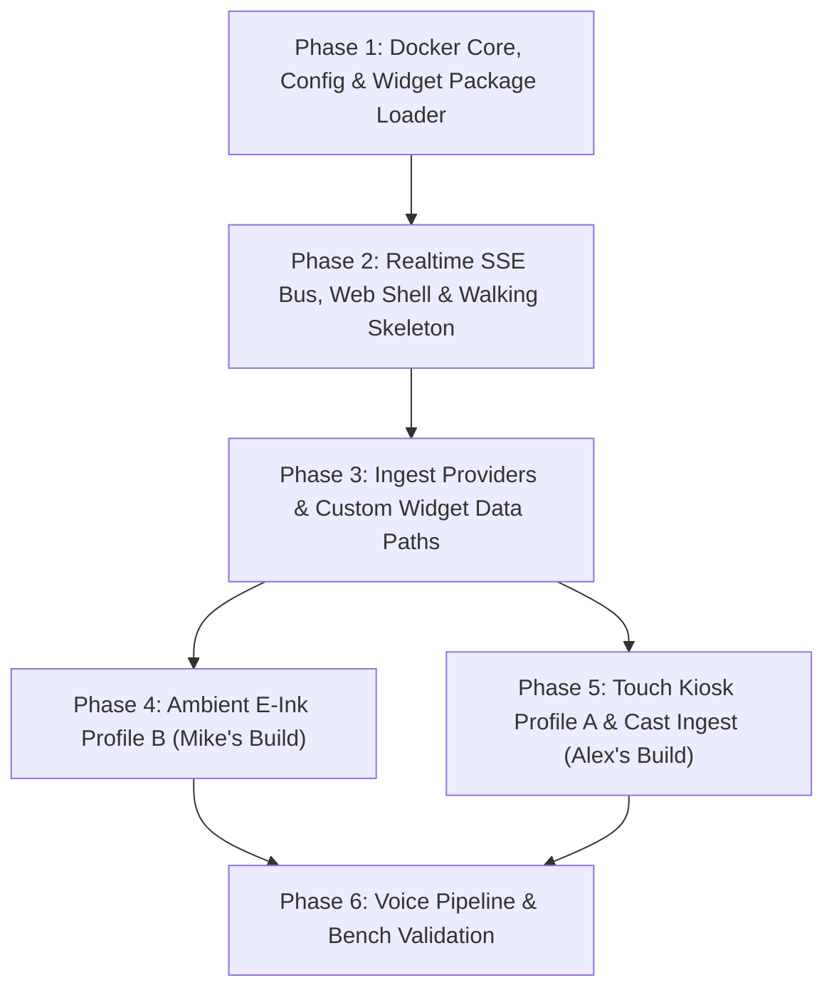

# SPEC-013: Implementation Roadmap & Engineering Plan

## Status
Approved / Architecture Defined

## Overview
This specification codifies the phased implementation roadmap, architectural milestones, and delivery sequence for **Mirrormere** ([azylman/mirrormere](https://github.com/azylman/mirrormere)), an open-source, local-first smart wall display and ambient dashboard framework.

Mirrormere decouples headless backend data ingestion, layout calculation, and real-time state synchronization from physical display surfaces. The architecture supports two reference deployment profiles:
1. **Touch Kiosk Profile A**: 60Hz interactive capacitive touchscreen (Intel N100 Mini PC, 15.6" 1080p display, Wayland `cage` compositor, Chromium `--kiosk`, and UVC/HDMI video ingest via `go2rtc`).
2. **Ambient E-Ink Profile B**: Low-power static monochrome dashboard (Raspberry Pi 4 Model B, Waveshare 7.5" black & white e-paper HAT with Adafruit Bonnet pinout, partial refresh lifecycle, and thin Python SPI display node).

This plan structures development into **six sequential milestones**, prioritizing Day-1 Dockerization and early visual feedback (a "walking skeleton" displaying live grid cells in Phase 2) before proceeding to external provider integrations, Ambient E-Ink bringup, and Touch Kiosk video capture.

---

## 1. Global Constraints & Engineering Quality Floor

All code, schemas, and assets committed to the repository must adhere to the following Day-1 engineering invariants:

- **Static Binary & Zero-CGO**: Built as Go 1.24 static Linux binaries with `CGO_ENABLED=0`. SQLite storage uses the pure-Go driver (`modernc.org/sqlite`).
- **Standard Library HTTP & Slowloris Mitigation**: Server uses standard library `net/http` configured with defensive timeouts (`ReadHeaderTimeout: 3s`, `ReadTimeout: 5s`, `WriteTimeout: 10s`, `IdleTimeout: 120s`). Long-lived SSE streaming endpoints disable write deadlines via `http.ResponseController(w).SetWriteDeadline(time.Time{})`.
- **API First & Zero Drift**: Single source of truth defined in `api/openapi.yaml` and `api/schemas/*.json`. Server interfaces and request/response types are generated via `oapi-codegen` into `internal/api/`.
- **Test Coverage Floor**: Strict `>= 95.0%` statement coverage floor across all Go packages, enforced by `scripts/check-coverage.sh` and `./scripts/verify.sh`.
- **Server-Side Rendering (SSR)**: Pure Go `html/template` executing on the daemon (`GET /api/widgets/{widget_id}/render`). Display clients receive and swap pre-rendered HTML fragments; zero client-side compilation or virtual DOM runtime.
- **Zero `${VAR}` String Interpolation**: Per SPEC-012 §6, configuration files resolve secrets exclusively through explicit `*_env` keys (`token_env`, `url_env`) reading directly from the host environment. Arbitrary string interpolation is prohibited.
- **Master Audio Ceiling**: Client software strictly enforces an 80% volume ceiling (`element.volume = (volume / 100) * 0.80 * (isDucked ? 0.20 : 1.0) * (isMuted ? 0.0 : 1.0)`). Zero host-level OS or PipeWire manipulation.
- **Read-Only Ambient Tasks Contract**: Mirrormere operates strictly as a read-only ambient display surface for lists and tasks (SPEC-008). Zero write mutations, zero provisional IDs, and zero client-side optimistic UI reconciliation.
- **Deterministic 6×2 Grid Engine**: 6 columns × 2 rows = 12 discrete cells below a fixed header zone, solved via a 2D recursive backtracking bitmask solver (`0x000` to `0xFFF`) with pinned widget replication, auto-computed minimum screens, and deficit guidance (SPEC-005).
- **Deployment-Time Configuration**: Configuration (enabled widgets, providers, credentials, layouts, and styles) is set statically at deployment time via `config.yaml` and mounted assets. Zero runtime theme switching or multi-tenant display multiplexing.

---

## 2. Milestone Overview & Dependency Flow

---

## 3. Detailed Phase Breakdown

### Phase 1: Docker Core Foundation, Config & Widget Package Loader
**Objective:** Establish Day-1 Docker Compose, authoritative OpenAPI/SSE contracts, config parser with LKGC, full widget package loader, and 6×2 layout solver with 100% test coverage before implementing business logic.

- **Task 1.1: Docker Compose Foundation & Scaffolding**
  - Implement root `deploy/compose.yml` defining the `mirrormere` daemon service with non-root security context, read-only volume mounts (`/config:ro`, `/data`), and healthchecks.
  - Multi-stage `Dockerfile` compiling static Go 1.24 binary (`CGO_ENABLED=0`) targeting minimal scratch/alpine base image.
  - Provide baseline `deploy/examples/config.yaml` and `deploy/examples/custom.css`.

- **Task 1.2: OpenAPI 3.1 Specification & SSE JSON Schemas**
  - Codify authoritative REST and SSE contracts in `api/openapi.yaml` and `api/schemas/`:
    - Schemas: `widget.update.json`, `header.update.json`, `screen.rotate.json`, `system.status.json`, `video.state.json`, `audio.state.json`, `voice.state.json`, `widget.reload.json`, `style.reload.json`.
    - Endpoints: `GET /healthz`, `GET /api/events`, `POST /api/screen/select`, `POST /api/screen/advance`, `POST /api/screen/pause`, `GET /api/audio`, `POST /api/audio/volume`, `POST /api/audio/mute`, `POST /api/video/trigger`, `dismiss`, `state`, `action`, `POST /api/voice/state`, `GET /api/lists/{list_id}/items`, `GET /api/widgets/{widget_id}/state`, `GET /api/widgets/{widget_id}/render`, `GET /widget-types/{type}/assets/{path}`, `POST /api/widgets/{widget_id}/push`.
  - Wire `oapi-codegen` code generation into `internal/api/` ensuring compile-time interface adherence.

- **Task 1.3: Configuration Engine with Explicit `*_env` Resolution & LKGC**
  - Parse `/config/config.yaml` with schema validation (`screens`, `widgets`, `display`, `providers`).
  - Resolve secrets strictly through explicit `*_env` keys (`token_env`, `url_env`) reading directly from process environment. Arbitrary `${VAR}` string interpolation is explicitly rejected (SPEC-012 §6).
  - In-memory Last-Known-Good Configuration (LKGC) fallback on parse or validation failure.

- **Task 1.4: Widget Package Loader & 6×2 Layout Bitmask Solver**
  - Package discovery across built-ins (`/app/widgets`) and custom overrides (`/config/widgets`). Enforce whole-package overriding invariant (a custom widget must supply a complete package: `manifest.yaml`, `views/widget.html`, assets).
  - Parse and validate `manifest.yaml` (validate supported dimensions, forbid `default` keyword in config schema).
  - Apply `default_dimensions` when instance config omits `width`/`height`.
  - Implement 2D recursive backtracking bitmask solver for 6×2 grid (`cols ∈ [0, 5]`, `rows ∈ [0, 1]`, 12 discrete cells):
    - Compute minimal rotation screens: $K = \lceil A_{\text{unpinned}} / (12 - A_{\text{pinned}}) \rceil$.
    - Pinned widget replication across all screens.
    - Bitmask placement verification (`screen_bitmask == 0xFFF`).
    - Layout deficit and spacer tile (`type: spacer`) guidance on tiling errors per SPEC-005.

---

### Phase 2: Realtime SSE Bus, Web Shell & Walking Skeleton
**Objective:** Deliver the centralized SSE bus, rotation engine, `html/template` SSR engine, `fsnotify` live reload, and vanilla ES6 display HUD—achieving an end-to-end "walking skeleton" displaying live grid cells in the browser.

- **Task 2.1: High-Performance SSE Bus & Initial Hydration**
  - `GET /api/events` handler supporting concurrent display clients.
  - Disable write deadlines via `http.ResponseController(w).SetWriteDeadline(time.Time{})`.
  - 1,000 events / 5-minute ring buffer for `Last-Event-ID` reconnection replay.
  - Periodic heartbeat ping (`: ping\n\n`) every 15s.
  - **Initial State Hydration Invariant (SPEC-006 §3)**: Immediately flushes full state snapshot across all configured widgets and screens on initial connection or expired `Last-Event-ID` (`screen.rotate`, all `widget.update`s, `header.update`, `video.state`, `audio.state`, `voice.state`, `system.status`).

- **Task 2.2: Screen Rotation Coordinator & Navigation Endpoints**
  - Timer-driven screen rotation (`display.rotation.interval_seconds`).
  - Emit `screen.rotate` carrying active screen index and SSR HTML fragments for current widgets.
  - Implement navigation endpoints: `POST /api/screen/select`, `POST /api/screen/advance`, and `POST /api/screen/pause` (with optional `duration_seconds: 120` auto-resume timer).

- **Task 2.3: Server-Side Rendering (SSR) Engine & Static Asset Pipeline**
  - In-process `html/template` renderer executing widget `views/widget.html`.
  - Route `GET /api/widgets/{widget_id}/render`: renders HTML fragment using active widget state.
  - Route `GET /widget-types/{type}/assets/{path}`: serves static assets from widget package directory.
  - Route `GET /config/custom.css`: serves user custom stylesheet.

- **Task 2.4: `fsnotify` File Watcher & Dynamic Hot Reloading (SPEC-012)**
  - Monitor `/config/` directory descriptor with 100ms debouncing and temporary file filtering.
  - On `config.yaml` modification: trigger atomic reload and state reconcile or LKGC fallback.
  - On `/config/custom.css` change: emit `style.reload` SSE event.
  - On `/config/widgets/` modification: reload template and emit `widget.reload` SSE event.

- **Task 2.5: Web Display HUD & Walking Skeleton**
  - Vanilla ES6 display client (`/display`): CSS grid canvas below fixed header zone.
  - Cyber HUD styling tokens (`hud.css`), DOM pre-warming to eliminate rotation flicker.
  - Built-in `spacer` widget (`widgets/spacer/manifest.yaml` & `views/widget.html`).
  - Deliverable: End-to-end working container where `/display` renders a live, rotating grid with header clock and spacer widgets.

---

### Phase 3: Ingest Providers & Custom Widget Data Paths
**Objective:** Implement decoupled data ingestion workers with Stale-While-Revalidate caching, rate limiting, custom HTTP polling/push paths, and zero-CGO SQLite storage.

- **Task 3.1: Provider Polling Coordinator & SWR Cache**
  - Pluggable `Provider` interface: `ID() string`, `Fetch(ctx context.Context) (any, error)`, `Interval() time.Duration`.
  - In-memory Stale-While-Revalidate cache: return stale data immediately on transient errors while logging background fetch failures.
  - Exponential backoff with jitter on network refusal or upstream 5xx.
  - Degraded state tracking: `healthy`, `degraded` (LKG preserved, opacity 0.8), `error` (cold-boot empty state).

- **Task 3.2: Custom Widget Data Paths (HTTP Polling & Webhook Push)**
  - Generic `provider: http` poller: query arbitrary JSON endpoints (`POST {endpoint}` carrying instance config, or `GET`), validate response against manifest schema, update widget state.
  - Webhook data path: `POST /api/widgets/{widget_id}/push` validates payload against schema and updates state.
  - Reject push webhooks targeting task widgets with `409 Conflict`.

- **Task 3.3: Core Ingest Providers (Calendar, Weather & Photos)**
  - Calendar: fetch and parse remote iCal (.ics) and CalDAV URLs (Google Calendar, iCloud, Fastmail/Nextcloud).
  - Weather: query Open-Meteo keyless API; autonomous poller emitting dedicated `header.update` SSE events (SPEC-007 §4).
  - Photos: zero-credential Google Photos shared album scraper extracting `AF_initDataCallback` image URLs with dynamic `=w{w}-h{h}-c` sizing parameters.
  - Built-in widget views: `calendar`, `weather`, and `photos`.

- **Task 3.4: Read-Only Tasks & Lists Service (SPEC-008)**
  - Pure-Go zero-CGO SQLite storage using `modernc.org/sqlite` in `/data/lists.db` (WAL mode, busy timeout 5000ms).
  - Read-only inspection endpoint: `GET /api/lists/{list_id}/items` (optional `include_done`).
  - Built-in `tasks` widget: strike-through completed items, "+N more" overflow, zero client mutation controls.

---

### Phase 4: Ambient E-Ink Profile B (Mike's Build)
**Objective:** Deliver the low-power e-paper rendering companion and standalone SPI daemon for the Raspberry Pi 4B so Mike's hardware can be stood up first.

- **Task 4.1: Headless Snapshot Sidecar (`sidecars/eink-renderer`)**
  - Dockerized headless Chromium capture service.
  - Capture 800×480 1-bit monochrome snapshot of `/display` on dirty trigger or rotation.
  - Floyd-Steinberg dithering for photos and grayscale images.
  - Expose 1-bit packed byte array or PNG at `GET /eink.png` with ETag caching.

- **Task 4.2: E-Ink Node Client (`clients/eink-node`)**
  - Standalone Python daemon running on Raspberry Pi 4B with Waveshare 7.5" e-paper display.
  - Adafruit Bonnet GPIO pin mapping: RST=27, DC=22, BUSY=17, CS=CE0 (GPIO 8), Buttons=GPIO 5 & 6 (SPEC-009).
  - Hardware button tap on GPIO 5/6 triggers `POST /api/screen/advance` on Core daemon.
  - Panel refresh lifecycle: 5s debounce, 60s minimum panel write floor, 60m full refresh cycle, deep sleep after every write.
  - Offline guard: 8×8 black dot in top-right corner if offline > 120s; persist last good frame to `/var/lib/mirrormere-eink/last.png`.
  - Standardized healthcheck endpoint on port 8099 (`GET :8099/healthz`).

---

### Phase 5: Touch Kiosk Profile A & Cast Ingest (Alex's Build)
**Objective:** Assemble the interactive 60Hz Touch Kiosk stack, hardware video capture pipeline, and Linux host provisioning.

- **Task 5.1: Audio Coordinator & DOM Ceiling**
  - Core audio endpoints: `GET /api/audio`, `POST /api/audio/volume`, `POST /api/audio/mute`.
  - Strict 80% DOM volume ceiling: `(vol/100)*0.80*(isDucked?0.2:1)*(isMuted?0:1)`. Zero host OS PipeWire manipulation.
  - Touch volume slider 200ms debounce during continuous drag; commit on `pointerup`.

- **Task 5.2: Video State Relay & Priority Stack**
  - Video priority stack: `doorbell` PiP > `chromecast` fullscreen.
  - Endpoints: `POST /api/video/trigger`, `dismiss`, `state`, `action`.
  - Embed go2rtc WebRTC stream playback with touch HUD overlay.

- **Task 5.3: CastV2 Socket Monitor (`sidecars/cast-watcher`) & `go2rtc` Ingest**
  - Connect to Chromecast TCP port 8009 over LAN.
  - Detect active casting (`appId != "E8C28D3C"`), trigger video overlay (`POST /api/video/trigger`), and dismiss on return to backdrop.
  - Hardware transcoding (`#video=h264#hardware` via Intel VAAPI/QSV on the N100) capturing UVC MS2130 and ALSA audio.

- **Task 5.4: Kiosk Host Provisioning & Wayland Confinement**
  - Minimal Wayland `cage` compositor launching Chromium with kiosk flags: `--kiosk --ozone-platform=wayland --use-gl=egl --autoplay-policy=no-user-gesture-required`.
  - Power management: `swayidle` 10m idle blanking (`wlr-randr --output HDMI-A-1 --off`) with capacitive touch wake (`evdev`), and systemd night schedule timers (23:00 sleep / 06:00 wake).
  - Nightly automated browser process restart during the sleep window to prevent 24/7 memory drift.

---

### Phase 6: Voice Pipeline, Integration & Bench Validation
**Objective:** Connect the voice state relay, verify multi-container profiles, and validate bench hardware.

- **Task 6.1: Voice State Relay & Caption Toasts**
  - `POST /api/voice/state` rebroadcasting `voice.state` SSE events to all connected clients.
  - Transient caption toasts for wake word / STT / TTS states.

- **Task 6.2: Multi-Arch Compose & Bench Bringup**
  - Multi-container Docker Compose profiles (`profiles: [video, eink]`).
  - Bench bringup on Alex's N100 touch sandwich and Mike's Pi 4B e-paper.
  - End-to-end integration tests and healthcheck verification.

---

## 4. Execution Strategy & Quality Gates

1. **Test-Driven Development (TDD)**: Every Go package must maintain companion `_test.go` suites achieving `>= 95.0%` statement coverage before moving to subsequent tasks.
2. **Autonomous GitOps PR Workflow**: Code modifications are submitted via isolated feature branches and pull requests, validated through `./scripts/verify.sh --staged` and GitHub Actions CI before merge.
3. **Review Panel Checks**: Plan and architecture audited by the 4-member Girl Gang review panel prior to executing major architectural transitions.
