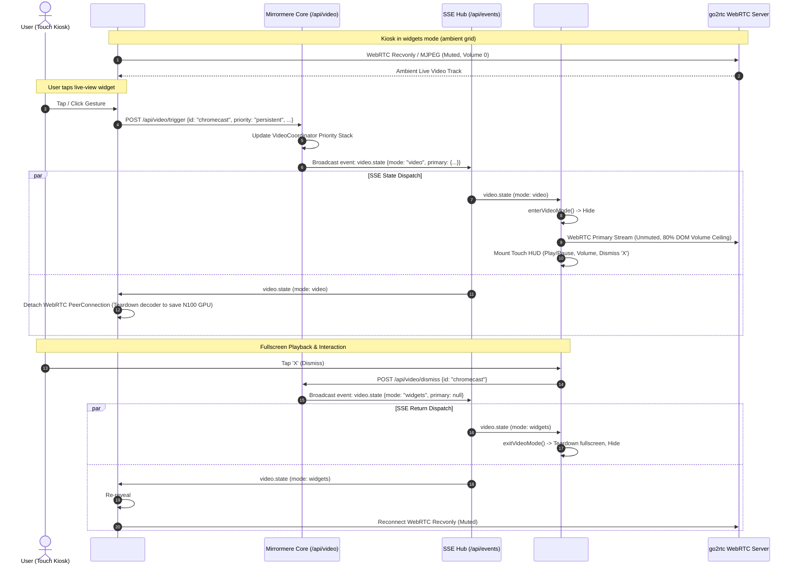

# SPEC-015: Live View Widget & Expand-to-Play Presentation (`live-view`)

## Status
Proposed / Architecture Defined

## Context & Motivation
Smart wall displays frequently integrate real-time video feeds from local devices:
1. **Google Chromecast Ingest**: An HDMI capture card (MacroSilicon MS2130 over USB UVC) continuously delivers an HDMI signal to `go2rtc` (SPEC-004 §6). When media is actively streaming (YouTube, Netflix, Spotify), `sidecars/cast-watcher` triggers fullscreen presentation mode. However, when idle or displaying Google Photos ambient art/screensaver, Mirrormere returns to `widgets` mode, leaving no ambient window into the Chromecast feed on the dashboard.
2. **Security & Alert Cameras**: Doorbell cameras, perimeter RTSP feeds, baby monitors, and 3D printer monitors benefit from persistent, passive display on the dashboard grid without stealing full-screen presentation focus or playing unexpected audio.
3. **Interactive Expansion**: Users viewing an ambient live feed on the touchscreen kiosk need the ability to tap the tile to instantly expand it into full interactive play mode (`video` mode) with unmuted audio, master volume controls, play/pause transport, and doorbell PiP alert docking.

`live-view` is a pluggable built-in widget package that decouples ambient tile monitoring on the 6×2 grid canvas from fullscreen presentation mode while providing a frictionless one-tap transition between the two.

---

## Goals
- **Ambient Grid Presentation**: Render live video streams (WebRTC, MJPEG, or HLS) directly within standard 6×2 grid dimensions (e.g. 2×1, 3×1, 3×2, 4×2, 6×2).
- **Strict Ambient Audio Isolation**: All `live-view` grid widgets remain strictly muted (`muted: true`, `volume: 0`) with zero audio playback while in `widgets` mode.
- **Click-to-Expand Handoff**: Tapping a `live-view` tile dispatches `POST /api/video/trigger`, promoting the stream to primary fullscreen presentation mode (`#video-stage`) with unmuted audio and Touch HUD controls.
- **Hardware Decoder Hygiene**: When the kiosk transitions to `video` mode (hiding `#grid-canvas`), `live-view` widgets cleanly detach their background WebRTC peer connections or pause stream consumption to prevent GPU/CPU decoder saturation on the Intel N100 Mini PC or Raspberry Pi 4.
- **Seamless Re-Hydration**: When fullscreen video mode is dismissed (returning to `widgets` mode), `live-view` widgets automatically reconnect and resume live monitoring.
- **1-Bit E-Ink Fallback**: For Ambient E-Ink displays (SPEC-009), display a periodic snapshot poster frame (`poster_url`) or clean static indicator rather than attempting WebRTC streaming.
- **100% Generic & Domain-Agnostic**: Core templates, schemas, and Go services contain zero hardcoded device names or Chromecast assumptions. All stream parameters are configured declaratively in `config.yaml`.

---

## Non-Goals
- **In-Widget Audio Playback**: Audio playback on the dashboard grid while multiple widgets are active creates cacophony and violates SPEC-004. Audio belongs exclusively to fullscreen `video` presentation mode.
- **Custom Ingest Sidecars**: Core does not manage physical capture hardware; it interfaces strictly with standard HTTP/WebRTC endpoints provided by `go2rtc` or external cameras.
- **On-Screen Keyboard Input**: All transport controls on expansion rely on the existing Touch HUD overlay (SPEC-004 §5, SPEC-010 §4).

---

## System Architecture & Interaction Flow



---

## Widget Manifest & Configuration Schema

### Manifest (`widgets/live-view/manifest.yaml`)
```yaml
name: live-view
version: "1.0.0"
description: Live video stream tile with one-tap expansion into fullscreen play mode.
provider: live-view

capabilities:
  - ambient-static
  - touch-interactive

default_dimensions: [3, 2]

supported_dimensions:
  - [2, 1]
  - [3, 1]
  - [4, 1]
  - [2, 2]
  - [3, 2]
  - [4, 2]
  - [6, 2]

config_schema:
  type: object
  required:
    - stream_url
  properties:
    stream_url:
      type: string
      description: URL of the live stream for the widget tile (WebRTC endpoint or MJPEG).
    stream_type:
      type: string
      enum: ["webrtc", "mjpeg", "hls"]
      default: "webrtc"
    title:
      type: string
      description: Optional overlay title displayed in the corner of the tile.
    poster_url:
      type: string
      description: Snapshot image URL for initial poster frame and e-ink rendering.
    expand_on_click:
      type: boolean
      default: true
      description: Whether tapping the widget expands into fullscreen video mode.
    # Video Presentation Parameters (forwarded to POST /api/video/trigger on expansion)
    stream_id:
      type: string
      description: Stream ID for the priority stack (e.g. "chromecast", "front-door"). Defaults to widget ID.
    priority:
      type: string
      enum: ["persistent", "temporary"]
      default: "persistent"
    timeout_seconds:
      type: integer
      minimum: 0
      default: 0
    controllable:
      type: boolean
      default: false
      description: Whether the stream supports transport controls (play/pause) when expanded.
    control_url:
      type: string
      description: Webhook URL on stream sidecar where Core forwards transport actions.
    expand_stream_url:
      type: string
      description: Optional override stream URL for fullscreen presentation. Defaults to stream_url.
    expand_stream_type:
      type: string
      enum: ["webrtc", "mjpeg", "hls"]
      description: Optional override stream format for fullscreen presentation. Defaults to stream_type.
  additionalProperties: false
```

### Household Configuration (`config.yaml`)
```yaml
display:
  widgets:
    - id: chromecast-live
      type: live-view
      dimensions: [3, 2]
      config:
        stream_url: "http://127.0.0.1:1984/api/webrtc?src=cast"
        stream_type: "webrtc"
        title: "Chromecast"
        poster_url: "http://127.0.0.1:1984/api/frame.jpeg?src=cast"
        expand_on_click: true
        stream_id: "chromecast"
        priority: "persistent"
        controllable: true
        control_url: "http://cast-watcher:8090/action"
```

---

## Client Runtime Lifecycle (`web/static/js/live_view.js`)

### 1. Mounting & Protocol Handlers
When the widget is rendered into `#grid-canvas`:
- **WebRTC (`webrtc`)**:
  - Creates a hidden/contained `<video autoplay muted playsinline class="live-view-media">`.
  - Instantiates `RTCPeerConnection` with a `recvonly` video transceiver. Audio transceiver is explicitly omitted or marked inactive (`direction: 'inactive'`) to prevent unnecessary bandwidth consumption and audio buffer allocation.
  - Submits SDP offer to `stream_url` and binds the incoming `MediaStream` to the video element.
- **MJPEG (`mjpeg`)**:
  - Mounts ``.
- **HLS (`hls`)**:
  - Initializes `Hls.js` or native HLS video binding with `muted: true`.

### 2. Click-to-Expand Interaction & In-Flight Lock
- Tap/click listener attached to the widget container (`.widget-live-view`).
- **In-Flight Click Lock**: When tapped, the widget sets an in-flight lock (`this.isLoading = true`), adds a `.loading` visual indicator (subtle glowing border), and disables further taps until either incoming `video.state` acknowledges `mode: "video"` or a 2,000ms safety timeout expires. This completely eliminates double-tap storms during network latency.
- Checks `config.expand_on_click !== false`.
- Dispatches HTTP POST to `/api/video/trigger`:
  ```json
  {
    "id": config.stream_id || widget_id,
    "stream_url": config.expand_stream_url || config.stream_url,
    "type": config.expand_stream_type || config.stream_type || "webrtc",
    "priority": config.priority || "persistent",
    "timeout_seconds": config.timeout_seconds || 0,
    "controllable": Boolean(config.controllable),
    "control_url": config.control_url || ""
  }
  ```
- Core handles the mutation and broadcasts `event: video.state`.

### 3. Background Power & Decoder Hygiene (SSE & Carousel Rotation)
- **Fullscreen Presentation Handoff**: `MirrormereLiveView` listens to global `video.state` events via `sseClient`:
  - **On `mode === 'video'`**:
    - Invokes `pauseStream()`: Closes the widget's `RTCPeerConnection` (or clears MJPEG `img.src = ''`) and sets `video.srcObject = null`.
    - Flushes Chromium hardware decoders while `#grid-canvas` is hidden.
  - **On `mode === 'widgets'`**:
    - If previously active, re-invokes `startStream()` to cleanly resume the live ambient feed.
- **Carousel Off-Screen Teardown**: To prevent GPU decoder saturation on the Intel N100 when multiple screens are configured, `live_view.js` attaches an `IntersectionObserver` to the widget root element:
  - When rotated off-screen (`isIntersecting === false`), it immediately tears down active peer connections and flushes video decoders.
  - When rotated into the active viewport (`isIntersecting === true`), it lazily negotiates WebRTC to resume playback.

### 4. Gestures & Navigation Conflict Prevention
- The widget enforces `touch-action: pan-x pan-y`.
- Gesture cancellation is harmonized directly with `MirrormereCarousel`: standard browser `click` event dispatching is used, where active carousel swipe drags (> 60px) cancel the click via `carousel.js` event suppression, eliminating touch dead zones.

---

## E-Ink & Ambient Display Adapter

On e-paper display nodes (`clients/eink-display-node`, SPEC-009):
- The rendering engine compiles `views/widget.html`.
- For `profile: eink` or server-side headless snapshots, the template checks `.Config.poster_url`:
  - If `poster_url` is provided: renders an `` tag pointing to the snapshot endpoint.
  - If omitted: renders a clean stylized cyber placeholder badge displaying the stream title and a camera glyph.
- Avoids spawning headless Chromium WebRTC negotiation processes during static image capture.

---

## Security, Error Recovery & LKGC Resilience

1. **Local-First Endpoint Trust**: Stream endpoints are expected to reside on the local host (`127.0.0.1:1984`) or trusted local LAN (`http://192.168.x.x`). Core sanitizes URLs before trigger submission.
2. **Offline Stream Recovery**: If `go2rtc` or the camera drops, the video element listens for `error` / `stalled` events and enters a backoff reconnect loop (5s, 10s, 30s) while rendering a graceful "Stream Offline" badge.
3. **LKGC Protection**: If `config.yaml` provides invalid `stream_url` or malformed properties, the config parser retains the Last-Known-Good Configuration (SPEC-012) and logs an alert.
